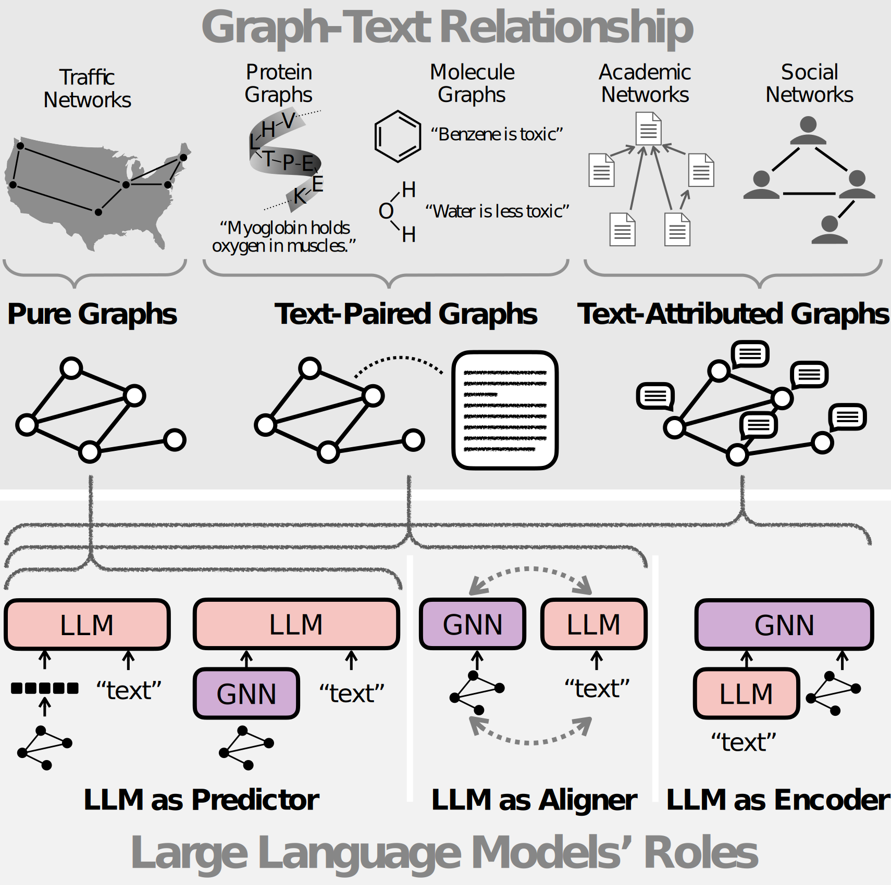
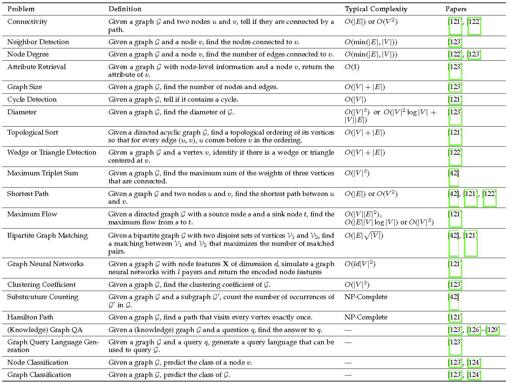
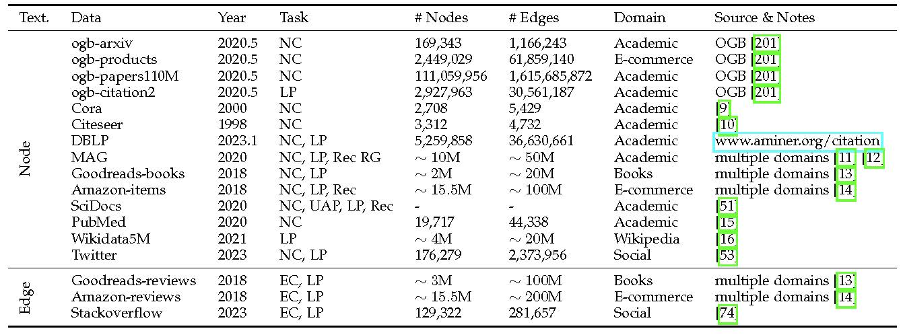
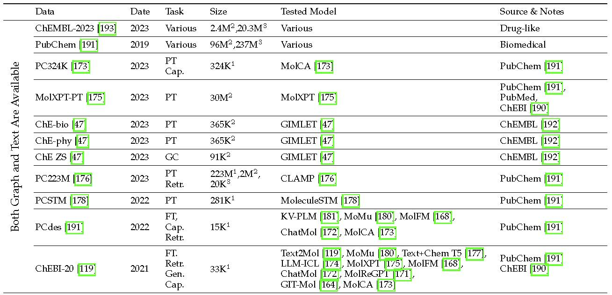

# Awesome-Language-Model-on-Graphs [](https://awesome.re)

A curated list of papers and resources about large language models (LLMs) on graphs based on our survey paper: [Large Language Models on Graphs: A Comprehensive Survey](https://arxiv.org/abs/2312.02783). 

**An awesome repo on multimodal learning on graphs an be found [here](https://github.com/PeterGriffinJin/Awesome-Multimodal-on-Graphs)**.

**This repo will be continuously updated. Don't forget to star  it and keep tuned!**

**Please cite the paper in [Citations](#citations) if you find the resource helpful for your research. Thanks!**

<p align="center">
    
</p>

## Why LLMs on graphs?

Large language models (LLMs), such as ChatGPT and LLaMA, are creating significant advancements in natural language processing, due to their strong text encoding/decoding ability and newly found emergent capability (e.g., reasoning).
While LLMs are mainly designed to process pure texts, there are many real-world scenarios where text data are associated with rich structure information in the form of graphs (e.g., academic networks, and e-commerce networks) or scenarios where graph data are captioned with rich textual information (e.g., molecules with descriptions).
Besides, although LLMs have shown their pure text-based reasoning ability, it is underexplored whether such ability can be generalized to graph scenarios (i.e., graph-based reasoning).
In this paper, we provide a comprehensive review of scenarios and techniques related to large language models on graphs.

## Contents

- [Awesome-Language-Model-on-Graphs ](#awesome-language-model-on-graphs-)
  - [Why LLMs on graphs?](#why-llms-on-graphs)
  - [Contents](#contents)
    - [Keywords Convention](#keywords-convention)
  - [Perspectives](#perspectives)
  - [Pure Graphs](#pure-graphs)
    - [ Datasets](#-datasets)
    - [ Direct Answering](#-direct-answering)
    - [ Heuristic Reasoning](#-heuristic-reasoning)
    - [ Algorithmic Reasoning](#-algorithmic-reasoning)
  - [Text-Attributed Graphs](#text-attributed-graphs)
    - [ Datasets](#-datasets-1)
    - [ LLM as Predictor (Node)](#-llm-as-predictor-node)
      - [Graph As Sequence (Node)](#graph-as-sequence-node)
      - [Graph-Empowered LLM (Node)](#graph-empowered-llm-node)
      - [Graph-Aware LLM Finetuning](#graph-aware-llm-finetuning)
    - [ LLM as Encoder](#-llm-as-encoder)
      - [Optimization](#optimization)
      - [Data Augmentation](#data-augmentation)
      - [Efficiency](#efficiency)
    - [ LLM as Aligner (Node)](#-llm-as-aligner-node)
      - [Prediction Alignment](#prediction-alignment)
      - [Latent Space Alignment (Node)](#latent-space-alignment-node)
  - [Text-Paired Graphs (Molecules)](#text-paired-graphs-molecules)
    - [ Datasets](#-datasets-2)
    - [ LLM as Predictor (Graph)](#-llm-as-predictor-graph)
      - [Graph As Sequence](#graph-as-sequence)
      - [Graph-Empowered LLM (Graph)](#graph-empowered-llm-graph)
    - [ LLM as Aligner (Graph)](#-llm-as-aligner-graph)
      - [Latent Space Alignment (Graph)](#latent-space-alignment-graph)
  - [Others](#others)
  - [Contribution](#contribution)
  - [Citations](#citations)


### Keywords Convention

 The Transformer architecture used in the work, e.g., EncoderOnly, DecoderOnly, EncoderDecoder.

 The size of the large language model, e.g., medium (i.e., less than 1B parameters), LLM (i.e., more than 1B parameters).


## Perspectives
1. **Unifying Large Language Models and Knowledge Graphs: A Roadmap.** `preprint`

    *Shirui Pan, Linhao Luo, Yufei Wang, Chen Chen, Jiapu Wang, Xindong Wu* [[PDF](https://arxiv.org/pdf/2306.08302.pdf)], 2023.6

    本文中提出了一个前瞻性的路线图，用于统一LLMs和KGs。我们的路线图包括三个通用框架：
    1）**KG增强的LLMs**，它在LLMs的预训练和推理阶段整合KGs，或为了增强对LLMs学习的知识的理解；
    2）**LLM增强的KGs**，利用LLMs进行不同的KG任务，如嵌入、补全、构建、图到文本生成和问答；
    3）协同的LLMs + KGs，其中LLMs和KGs扮演平等的角色，并以互利的方式工作，通过数据和知识驱动的双向推理来增强LLMs和KGs。

2. **Integrating Graphs with Large Language Models: Methods and Prospects** `preprint`
    
    *Shirui Pan, Yizhen Zheng, Yixin Liu* [[PDF](https://arxiv.org/pdf/2310.05499.pdf)], 2023.10

    本文探讨了将 LLMs 与图结构数据相结合的方法和前景。作者将这种结合分为两大类：
    一是**利用LLMs增强图学习**，二是**利用图结构提升LLMs的能力**。在第一类中，LLMs被用于处理各种图相关任务，包括预测图属性、节点和图分类等。在第二类中，通过利用图结构，可以显著提升LLMs在复杂问题解决中的效能。
    文章还讨论了使用LLMs处理图任务的两个主要优势：透明度和丰富的先验知识库。

    文章提出了以下开放性问题和未来的研究方向：
    a. LLMs Enhancing Graph Learning:
      - 如何利用LLMs学习除了**文本属性图之外的其他类型的图**？
      - 如何帮助LLMs**理解图**？这涉及到图描述语言的选择和LLMs在图上的预训练或微调。
  
    b. Graphs Enhance LLM Ability:
      - 如何提升更复杂的图结构以增强LLM推理能力？例如，探索超图、概率图模型和符号图等。
      - 如何提升更复杂的图结构以增强多智能体系统（Multi-Agent Systems, MLS）？例如，采用树、传统图甚至更复杂的结构来指导MLS。
      - 如何将图结构整合到LLMs的整个生命周期中？这包括在训练、微调和推理阶段利用图结构。

    未来方向包括：
      - 将不同数据类型转换为文本格式，以便LLMs处理。
      - 利用**多模态模型进行图-文本对齐**，以利用多模态LLMs的能力。
      - 扩展**图描述语言**，使LLMs能更有效地理解和处理图。
      - 在图数据上预训练或**微调**LLMs，以更好地理解图。
      - 建立大规模的**基础图模型**，使图学习能够利用LLMs的先验知识和可扩展性。
      - 探索不同的图类型，以显著提升LLM推理能力。
      - 在团队基础的LLM工作流程中采用不同的图形式，以提高效率。
      - 在LLMs的训练、微调和推理阶段利用图结构，以实现更有效的学习。


3. **Towards graph foundation models: A survey and beyond.** `preprint`

    *Jiawei Liu, Cheng Yang, Zhiyuan Lu, Junze Chen, Yibo Li, Mengmei Zhang, Ting Bai, Yuan Fang, Lichao Sun, Philip S. Yu, Chuan Shi.* [[PDF](https://arxiv.org/pdf/2310.11829.pdf)], 2023.10

    **图基础模型定义**
    图基础模型（GFMs）是一种在广泛图数据上预训练的大模型，旨在适应各种  下游图学习任务。GFMs具备两个主要特征：涌现和同质化。涌现指的是随着模型规模的增加，可能会自发地展现出新的能力。同质化则表示模型的多功  能性，使其能够应用于多种不同的任务。
    **现有工作分类**
    现有工作根据对图神经网络（GNNs）和 LLMs 的依赖程度，被分为以下三类：
    a. **GNN-based模型**：这些模型完全依赖于GNNs，通过预训练和微调来适应不同的图任务。它们通常使用图结构数据进行训练，并在特定的图任务上进  行微调。
    b. **LLM-based模型**：这些模型完全依赖于LLMs，通过将图结构转换为文本形式，利用LLMs的强大语言理解和生成能力。它们通常使用文本数据进行训  练，并在特定的图任务上进行微调。
    c. **GNN+LLM-based模型**：这些模型结合了GNNs和LLMs的优势，通过联合预训练和微调来适应不同的图任务。它们同时使用图结构数据和文本数据进行  训练，并在特定的图任务上进行微调。。

4. **A Survey of Graph Meets Large Language Model: Progress and Future Directions.** `preprint`

    *Yuhan Li, Zhixun Li, Peisong Wang, Jia Li, Xiangguo Sun, Hong Cheng, Jeffrey Xu Yu.* [[PDF](https://arxiv.org/pdf/2311.12399.pdf)], 2023.11

    本文是一篇关于如何将 LLMs 应用于图相关任务的综述文章。

    **LLM作为增强器**
    
    方法介绍：
   - LLM作为增强器的方法主要集中在利用LLMs的强大语言理解和生成能力来增强GNNs的性能。这通常涉及到生成额外的文本信息，如解释、知识实体或伪标签，这些信息可以用来丰富节点嵌入，从而提高GNNs在各种任务中的表现。
  
    优势：
   - 丰富的语义信息：LLMs能够生成包含丰富语义信息的文本，这些信息可以帮助GNNs更好地理解节点和边的含义，从而提高分类和其他任务的准确性。
   - 灵活性：这种方法允许GNNs利用LLMs的最新技术进步，通过插件式的方式快速适应新的任务和数据集。
  
    局限性：
   - 计算成本：生成大量的文本信息可能需要大量的计算资源，尤其是在处理大规模图数据时。
   - 数据稀疏性：在某些图数据集中，节点可能缺乏足够的文本信息，这限制了LLMs生成有用信息的能力。
  
    **LLM作为预测器**
    方法介绍：
   - LLM作为预测器的方法直接利用LLMs进行预测，这通常涉及到将图形数据转换为文本描述，以便LLMs可以直接处理。这种方法的核心思想是利用LLMs在处理文本方面的优势来处理图形数据。
  
    优势：
   - 直接处理文本：LLMs可以直接处理文本信息，这使得它们在处理具有丰富文本属性的图数据时表现出色。
   - 零样本学习：LLMs在零样本学习方面表现出色，这意味着它们可以在没有特定任务训练的情况下进行有效的预测。
  
    局限性：
   - 图形结构的复杂性：将图形数据转换为文本可能会丢失一些结构信息，这可能会影响LLMs的预测性能。
   - 长程依赖：LLMs可能难以捕捉到图形中的长程依赖关系，这在某些图形任务中可能是至关重要的。
  
    **GNN-LLM对齐**
    方法介绍：
   - GNN-LLM对齐的方法侧重于通过对齐技术语义上增强GNNs。这可能涉及到将GNNs和LLMs的嵌入空间对齐，以便它们可以协同工作。这种方法的目标是保留每个Encoder的独特功能，同时在特定阶段协调它们的嵌入空间。
  
    优势：
   - 互补性：GNNs和LLMs可以互补，GNNs擅长捕捉结构信息，而LLMs擅长处理文本信息，对齐可以使两者的优势得到充分利用。
   - 灵活性：对齐方法可以根据具体任务的需求灵活调整，以达到最佳的性能。
  
    局限性：
   - 数据稀缺性：对齐方法可能需要大量的带有标签的数据来进行有效的训练，而在某些领域，这样的数据可能很难获得。
   - 模型复杂性：对齐方法可能涉及到复杂的模型架构和训练过程，这可能会增加实现和部署的难度。
  
    **其他**
    方法介绍：
   - 其他类别包括那些难以归类到上述三个主要类别的模型。这些方法可能涉及到LLMs的其他应用，如作为注释器、控制器或样本生成器。


## Pure Graphs

###  Datasets
Table 3 in our survey paper [Large Language Models on Graphs: A Comprehensive Survey](https://arxiv.org/abs/2312.02783).
<p align="center">
    
</p>


###  Direct Answering
1. **Can Language Models Solve Graph Problems in Natural Language?** `preprint`

    *Heng Wang, Shangbin Feng, Tianxing He, Zhaoxuan Tan, Xiaochuang Han, Yulia Tsvetkov.* [[PDF](https://browse.arxiv.org/pdf/2305.10037.pdf)] [[Code](https://github.com/Arthur-Heng/NLGraph)], 2023.5,  

    本文提出了一种新的基准测试NLGraph，旨在评估 LLMs 在处理**自然语言描述的图形问题**方面的能力。NLGraph包含了29,370个问题，覆盖了从简单到复杂的八个**图形推理任务**。研究者们使用GPT-3和GPT-4模型进行了实验，并采用了不同的提示技术来提高模型的图形推理能力。

    研究结果表明，LLMs在简单的图形推理任务上表现出了初步的图形推理能力，但在更复杂的任务上，高级提示方法的效果并不明显，甚至可能产生反作用。此外，LLMs在面对问题设置中的偶然相关性时表现出脆弱性，这表明它们可能依赖于某些错误的相关性来进行推理。

    为了解决这些问题，研究者们提出了两种基于指令的提示方法：Build-a-Graph Prompting和Algorithmic Prompting。这两种方法通过提供额外的指导来帮助LLMs更好地理解和解决图形问题。实验结果显示，这些方法在多个任务上显著提高了LLMs的性能。

    - **Build-a-Graph Prompting (BAG)**
    Build-a-Graph Prompting (BAG) 是一种旨在提高语言模型处理图形问题能力的提示技术。这种方法的核心思想是在解决具体问题之前，先将文本描述的图形映射到基于概念的空间中。具体来说，BAG 通过在图形的文本描述之后附加一个指令 "Let's construct a graph with the nodes and edges first." 来引导语言模型首先构建出图形的结构。这样做可以帮助语言模型消化图形信息，将其映射到概念空间中，并为即将到来的查询做好准备。
    - **Algorithmic Prompting**
    Algorithmic Prompting 是另一种提示技术，它通过提供算法细节来帮助语言模型生成合理且准确的解决方案。这种方法假设为了让语言模型能够生成正确的解决方案，它们需要回顾并复述与给定任务相关的算法。例如，在最短路径任务中，可以通过添加 "We can use a Depth-First Search (DFS) algorithm..." 来引导语言模型使用深度优先搜索算法。类似地，对于其他图形推理任务，也可以在各自的提示中提供相应的算法描述。Algorithmic Prompting 的目的是在实际解决问题之前，赋予语言模型对如何解决问题的一般理解。
    - **结合使用**
    这两种提示技术可以与上下文学习和思维链提示结合使用。在实验中，研究者们将这两种方法与思维链提示结合，并在NLGraph基准测试的三个代表性任务上进行了评估。结果表明，在相对较容易的图形推理任务上，这两种基于指令的提示技术带来了3.07%到16.85%的性能提升。然而，在更复杂的Hamilton路径任务上，这两种提示方法的效果并不明显。这表明，尽管这些简单指令能够提高语言模型在较容易任务上的图形推理能力，但如何在更复杂的图形推理任务上提高它们的表现仍然是一个开放的研究问题。

2. **GPT4Graph: Can Large Language Models Understand Graph Structured Data ? An Empirical Evaluation and Benchmarking.** `preprint`

    *Jiayan Guo, Lun Du, Hengyu Liu, Mengyu Zhou, Xinyi He, Shi Han.* [[PDF](https://arxiv.org/abs/2305.15066)], 2023.5,  

    本文主要探讨了大型语言模型（LLM）在理解图结构数据方面的能力。研究者们通过一系列实验，评估了LLM在处理不同类型图数据任务中的表现，并提出了一个新的框架，将LLM与图结构数据相结合，以提高它们在广泛图挖掘任务中的协同能力。此外，研究者们还建立了一个基准测试，涵盖了十个常见场景，以评估语言模型处理与图相关的任务的能力。

    **框架实现**
    研究者们提出的框架旨在将大型语言模型（LLM）与图结构数据相结合，以提高它们在图挖掘任务中的表现。以下是框架实现的关键步骤：
   1. 图描述语言：首先，研究者们将图数据转换为图描述语言（GDL），这是一种可以被LLM理解的格式。这包括使用邻接表、边列表、GML和GraphML等不同的图描述语言。
   2. 提示处理器：然后，提示处理器将用户查询和GDL结合起来，形成LLM的输入。这个过程可能涉及到手动提示和自我提示策略，以及不同的图描述语言。
   3. 推理和生成答案：LLM根据输入进行推理，并生成答案。在推理过程中，LLM可能会生成中间输出，这些输出需要由提示处理器处理，以形成新的输入给LLM。
   4. 自我提示：在某些情况下，给定的图上下文可能包含较少有用或冗余的信息。因此，需要LLM进行自我提示，以获取更多信息或消除给定输入中的无关信息。
   5. 上下文总结和格式解释：LLM可以生成图的上下文总结，提取关键特征，如重要节点、边或子图。此外，LLM还可以自己生成格式解释，以获得更多上下文信息。
   
    **任务系列**
    研究团队开发了一系列任务，这些任务覆盖了十个常见的场景，用于检查LLM处理涉及图数据的任务的能力。以下是任务系列的详细介绍：
    1. 结构理解任务：
       - 图大小检测：评估LLM确定图中节点和边数量的能力。
       - 度检测：评估LLM理解节点在图中的上下文相关性，即节点度的能力。
       - 边检测：评估LLM识别给定节点的邻近节点的能力。
       - 属性检索：评估LLM检索有关节点的特定信息，如节点属性的能力。
       - 直径计算：评估LLM计算图直径的能力，即图中最长的最短路径。
       - 聚类系数计算：评估LLM计算图的聚类系数的能力，这是一个衡量图中节点聚集程度的指标。
    2. 语义理解任务：
       - 知识图谱问答（KGQA）：评估LLM回答与知识图谱相关的问题的能力。
       - 图查询语言生成（GQL Generation）：评估LLM生成满足用户需求的图查询语言的能力。
       - 节点分类：评估LLM根据节点的属性或结构特征对图中的节点进行分类的能力。
       - 图分类：评估LLM对整个图进行分类的能力，这需要LLM理解和应用图的结构和属性特征。

    这些任务的设计旨在全面评估LLM在处理图数据方面的性能，并为未来的研究提供基准和方向。

3. **Evaluating Large Language Models on Graphs: Performance Insights and Comparative Analysis.** `preprint`

    *Chang Liu, Bo Wu.* [[PDF](https://arxiv.org/abs/2308.11224)] [[Code](https://github.com/Ayame1006/LLMtoGraph)], 2023.8, [[PDF](https://arxiv.org/abs/2305.15066)], 2023.5,  

    本文系统地**评估了 LLMs 在理解和处理图数据方面的能力**。研究者们通过设计一系列基于图拓扑的问题来测试四种不同的LLMs，包括GPT-3.5-turbo、GPT-4、CalderaAI/30B-Lazarus和TheBloke/Wizard-Vicuna-13B-Uncensored-HF。评估使用了四个维度的指标：理解力、正确性、忠实度和修正能力。

    文章中提到，为了将图数据输入到 LLMs 中，研究者们采用了**节点列表和边列表**的形式来表示图数据。这些列表以纯文本格式呈现，其中节点和边都按照数值顺序组织。具体来说：

    1. 节点列表：包含图中所有节点的列表。
    2. 边列表：包含图中所有边的列表，每条边由两个节点组成，表示这两个节点之间的连接。

    结果表明：
    1. LLMs能够有效地理解自然语言中的图数据，并与图拓扑进行推理。
    2. GPT模型能够生成逻辑连贯的结果，在正确性方面优于其他替代模型。3. 所有检查过的LLMs在结构推理方面都面临挑战，像零样本思维链和少量样本提示这样的技术显示出效果减弱。
    4. GPT模型在多答案任务中经常产生错误答案，引起对忠实度的担忧。
    5. GPT模型对其输出表现出过高的信心，这可能阻碍了它们的修正能力。

4. **Talk Like A Graph: Encoding Graphs For Large Language Models.** `preprint`

    *Bahare Fatemi, Jonathan Halcrow, Bryan Perozzi.* [[PDF](https://arxiv.org/pdf/2310.04560.pdf)], 2023.10,  

    文章发现LLM在图推理任务上的表现受到三个基本层面的影响：（1）图编码方法，（2）图任务本身的性质，以及（3）有趣的是，所考虑图的结构本身。

    **图编码方法的深入研究**
    1. 节点和边的编码：研究了多种节点和边的编码技术，包括整数编码、英文名字、电视角色名、政治家名字等，以及不同的边表示方法，如括号、友谊、作、社会网络、箭头和事件。
    2. 图编码函数：开发了一系列图编码函数，结合节点和边的编码，如邻接、件、合作、友谊、社交网络、政治家和专家编码。
    3. 编码函数的效果评估：通过实验评估了不同编码函数在基本图任务上的性能， 如边存在性、节点度数、节点计数、边计数、连接节点和环检查。
    图任务性质的影响
    4. 基本图任务的挑战：研究了LLM在执行基本图任务时的表现，发现LLM在这些任务上通常表现不佳，尤其是在需要多步推理的任务上。
    5. 提示技术的选择：探索了不同的提示技术，如零次提示、少样本学习、链式思 维提示等，以找到最适合特定图任务的提示方法。
    6. 任务难度与模型性能的关系：分析了任务难度对LLM性能的影响，发现简单任务可能不需要复杂的提示技术，而复杂任务则可能受益于多步推理或示例引导。

    **图结构的作用**
    1. 图生成算法：使用了多种图生成算法，如Erdos-Rényi、    Barabási-Albert、随机块模型等，来创建具有不同特性的图。
    2. 图结构对推理的影响：研究了不同图结构对LLM推理能力的影响，发现图的特性（如连通性、度分布）会影响LLM的性能。
    3. 图结构的多样性：强调了在评估LLM图推理能力时考虑图结构多样性的必要性，以避免评估偏差并提供更现实的基准测试。


5. **GraphLLM: Boosting Graph Reasoning Ability of Large Language Model.** `preprint`

    *Ziwei Chai, Tianjie Zhang, Liang Wu, Kaiqiao Han, Xiaohai Hu, Xuanwen Huang, Yang Yang.* [[PDF](https://arxiv.org/pdf/2310.05845.pdf)] [[Code](https://github.com/mistyreed63849/graph-llm)], 2023.10,  

    本文提出了一种名为GraphLLM的方法，旨在提高 LLMs 在图数据推理方面的能力。

    GraphLLM模型结构主要包括三个主要步骤，分别是节点理解（Node Understanding）、结构理解（Structure Understanding）和图增强的前缀调整（Graph-enhanced Prefix Tuning）。下面详细介绍这三个部分：
   1. **节点理解**（Node Understanding）
    节点理解模块使用文本变换器 Encoder-Decoder 来从节点的文本描述中提取对解决图推理任务至关重要的语义信息。Encoder 首先对节点描述应用自注意力机制，生成一个捕获与图推理任务相关的语义含义的上下文向量。随后，Decoder通过上下文向量和查询之间的交叉注意力产生节点表示。
   2. **结构理解**（Structure Understanding）
    结构理解模块使用 Graph Transformer 来学习图结构。在GraphLLM框架中，Graph Transformer 的核心优势在于它将节点信息和结构信息解耦。Graph Transformer 主要由两个关键设计组成：位置编码和图上的注意力机制。
   3. **图增强的前缀调整**（Graph-enhanced Prefix Tuning）
    为了在图推理任务中生成人类语言响应，LLMs在调整过程中使用从图表示派生的图增强可调前缀。具体来说，图增强前缀通过将**图表示**应用 **Linear Projector** 获得，其中利用一个**转换维度**的矩阵。然后，这个前缀被**添加到LLMs的每一层注意力**中。


6. **LLM4DyG: Can Large Language Models Solve Problems on Dynamic Graphs?.** `preprint`

    *Zeyang Zhang, Xin Wang, Ziwei Zhang, Haoyang Li, Yijian Qin, Simin Wu, Wenwu Zhu* [[PDF](https://arxiv.org/pdf/2310.17110.pdf)] [[Code]()], 2023.10,  
    
    文章首次提出了评估LLMs在动态图上空间-时间理解能力的基准测试。文章提出了分离空间-时间思维（DST2）的方法，以增强LLMs的空间-时间理解能力。主要观察结果是：
    1) LLMs在动态图上具有初步的空间-时间理解能力；
    2) 随着图的大小和密度增加，动态图任务对LLMs的难度逐渐增加，但对时间跨度和数据生成机制不敏感；
    3) 提出的DST2提示方法有助于提高LLMs在大多数任务上的空间-时间理解能力。

    分离空间-时间思维（DST2）方法旨在增强 LLMs 在处理动态图时的**空间-时间理解能力**。**动态图数据**被转换为LLMs可以理解和处理的**文本形式**，使得模型能够执行与图相关的任务。该方法通过以下步骤实现：
    1. 任务分解：将复杂的动态图问题分解为更简单的子任务，这些子任务分别关注空间或时间维度的信息。
    2. 独立编码：对每个子任务进行独立编码，确保模型在处理空间信息时不会受到时间信息的干扰，反之亦然。
    3. 交互融合：在独立编码的基础上，通过交互融合机制使模型能够在必要时整合空间和时间信息，以解决需要同时考虑空间和时间维度的问题。
    4. 迭代优化：通过迭代优化过程不断调整模型的参数，以提高其在动态图上的空间-时间理解能力。
    5. 实验验证：通过在LLM4DyG基准测试上进行实验，验证DST2方法的有效性。实验结果显示，DST2能够帮助LLMs在大多数任务上提高空间-时间理解能力。
    DST2方法的关键在于通过分离和独立处理空间和时间信息，然后在需要时进行有效的整合，从而提高LLMs在动态图上的整体表现。

7. **Which Modality should I use - Text, Motif, or Image? : Understanding Graphs with Large Language Models.** `preprint`

    *Debarati Das, Ishaan Gupta, Jaideep Srivastava, Dongyeop Kang* [[PDF](https://arxiv.org/pdf/2311.09862.pdf)] [[Code]()], 2023.11,  

    本文探讨了如何将 LLMs 应用于图结构数据，特别是在节点分类任务中。研究者们提出了一种新的方法，通过结合不同的模态（文本、图像和图模态）以及提示来编码图结构，以便更好地利用LLMs处理复杂图的能力。他们还开发了一个名为GRAPHTMI的新基准测试，用于评估LLMs在图结构分析方面的性能。

    研究的关键发现包括：

    1. 图像模态在处理图相关任务时比文本模态更有效，因为它能够在保持关键信息的同时平衡 token 限制。
    2. 图任务分类所选择的编码模态取决于任务的难度，这可以通过同质性和图模态的数量来评估。对于中等难度的任务，图像模态是最优的；而对于更难的任务，则是图模态。
    3. 边编码函数、图结构和图采样技术等因素会影响使用文本模态进行节点分类的性能。
    4. 与图模态计数信息相比，图模态附着信息对节点分类的影响更大。
    5. 图像表示与人类可读性的关联对节点分类性能有积极影响。

    在这项研究中，为了将不同模态的数据输入到 LLMs ，研究者们采用了以下方法：
    1. 文本模态：将图中的节点映射到标签，并使用字典格式表示。不同的边编码表示被实验性地应用，例如邻接表或边列表，以提供局部上下文。这种方法允许LLMs通过文本描述来理解图的结构。
    2. 图模态：通过识别未标记节点周围的网络模体（network motifs），并将这些模体作为图模体信息输入到GPT-4中。网络模体是社交和生物网络中常见的重复模式，它们有助于理解局部结构和行为。
    3. 图像模态：使用图形渲染方法生成带有颜色编码节点的图的图像表示。这些图像被设计为具有高人类可读性，通过各种图像修改来提高。GPT-4V（一种多模态模型）被用来解释这些图图像，提供图结构的全局上下文。

    具体来说，研究者们通过以下步骤将不同模态的数据输入到LLMs中：
    - 文本编码：将图转换为文本序列，其中节点和边的信息被编码为易于LLMs处理的格式。
    - 图模体编码：识别并提取图中的关键模体，然后将这些模体作为额外的信息输入到LLMs中，以帮助分类未标记的节点。
    - 图像编码：生成图的视觉表示，并将其作为图像输入到支持图像处理的LLMs中，如GPT-4V。
    通过这些方法，研究者们能够将图数据的不同方面以适合LLMs的形式呈现，从而评估LLMs在处理图结构数据时的性能和潜力。

8. **GraphArena: Benchmarking Large Language Models on Graph Computational Problems.** `preprint`

    *Jianheng Tang, Qifan Zhang, Yuhan Li, Jia Li* [[PDF](https://arxiv.org/abs/2407.00379)] [[Code](https://github.com/squareRoot3/GraphArena)], 2024.7,  

    本文介绍了一种名为GraphArena的基准测试工具，旨在通过图计算问题来评估 LLMs 的推理能力。
    研究者们还测试了专门针对图问题进行微调的LLMs，如GraphWiz，但发现这些模型在GraphArena基准测试中的表现并不理想，这表明需要更深入的理解和更强的推理能力来解决图计算问题。

9. **LLMs hallucinate graphs too: a structural perspective.** `preprint`

    *Erwan Le Merrer, Gilles Tredan* [[PDF](https://arxiv.org/abs/2409.00159)], 2024.9,  


    本文探讨了 LLMs 在处理图结构数据时产生的幻觉现象，并提出了一种新的评估方法。作者首先介绍了LLMs在处理图结构时可能出现的错误输出，即“幻觉”。他们通过向LLMs请求著名的图结构（如Karate俱乐部图、悲惨世界图等），并将其输出与真实图进行比较，来观察LLMs的幻觉表现。
    文章的主要贡献包括：
    1. 拓扑幻觉的多样性观察：作者观察了不同LLMs在处理图结构时产生的拓扑幻觉，并发现所有测试的LLMs都存在一定程度的幻觉。
    2. 图集距离（Graph Atlas Distance, GAD）的提出：为了量化LLMs的幻觉程度，作者提出了图集距离这一指标，它是基于图编辑距离的平均值，用于衡量LLMs输出图与标准图集中的图之间的差异。
    3. 与幻觉排行榜的比较：作者将提出的GAD指标与现有的幻觉排行榜进行了比较，发现两者之间存在一定的相关性，这表明GAD可能是一个有效的评估工具。
    此外，文章还讨论了LLMs在处理图结构时可能存在的问题，如过度拟合和推理能力不足。作者指出，LLMs需要改进对结构化数据的处理能力，以便更准确地生成图结构。

###  Heuristic Reasoning
1. **StructGPT: A General Framework for Large Language Model to Reason over Structured Data.** `preprint`

    *Jinhao Jiang, Kun Zhou, Zican Dong, Keming Ye, Wayne Xin Zhao, Ji-Rong Wen.* [[PDF](https://arxiv.org/abs/2305.09645)] [[Code](https://github.com/RUCAIBox/StructGPT)], 2023.5,  

    本文提出了一个名为StructGPT的通用框架，旨在提高 LLMs 处理结构化数据时的推理能力。作者受到工具增强研究的启发，开发了一个迭代阅读-推理（IRR）框架，该框架通过专门的接口从结构化数据中提取相关信息，并使LLMs能够集中精力进行推理。为了实现这一点，作者设计了一个调用-线性化-生成过程，帮助LLMs理解和操作结构化数据。

    **调用阶段**
    在调用阶段，框架会使用专门的接口来收集结构化数据中的相关信息。这可能涉及到从数据库中检索记录、从知识图谱中提取关系或从表格中选择特定的列。

    **线性化阶段**
    在线性化阶段，框架将收集到的结构化数据转换为LLMs能够理解的线性文本格式。这一步骤对于LLMs来说至关重要，因为它们通常只能处理平面的文本数据，而不是复杂的结构化数据。

    **生成阶段**
    在生成阶段，LLMs基于线性化的数据进行推理，并生成答案。这个过程可能会涉及到多轮的交互，LLMs需要不断地调用接口、线性化数据并生成答案，直到得到最终的结果。


2. **Think-on-Graph: Deep and Responsible Reasoning of Large Language Model on Knowledge Graph.** `preprint`

    *Jiashuo Sun, Chengjin Xu, Lumingyuan Tang, Saizhuo Wang, Chen Lin, Yeyun Gong, Lionel M. Ni, Heung-Yeung Shum, Jian Guo.* [[PDF](https://arxiv.org/abs/2307.07697)] [[Code](https://github.com/GasolSun36/ToG)], 2023.7,  


    本文提出了一种名为Think-on-Graph（ToG）的算法框架，旨在通过结合 LLMs 和Knowledge Graphs来提高LLMs在复杂知识推理任务中的表现。ToG的核心思想是让LLM作为代理，在知识图谱上执行束搜索，动态探索推理路径，并根据检索到的知识做出决策。这种方法不仅提高了LLMs的深度推理能力，还增强了推理过程的可解释性和透明度。
    文章的主要贡献包括：
    1. LLM & KG范式：提出了一个新的LLM-KG集成范式，将LLM和KG紧密结合起来，互补各自的能力。
    2. Think-on-Graph（ToG）框架：实现了一个算法框架，允许LLM在KG上进行深度和负责任的推理。
    3. 性能提升：通过实验验证了ToG在多个数据集上的优越性能，特别是在多跳知识推理任务中。
    4. 灵活性和效率：ToG提供了一个即插即用的框架，适用于不同的LLMs和KGs，无需额外训练。
    5. 知识追溯和纠正：ToG能够追踪推理路径中的错误，并利用LLM的知识来纠正KG中的错误。

3. **Exploring Large Language Model for Graph Data Understanding in Online Job Recommendations.** `preprint`

    *Likang Wu, Zhaopeng Qiu, Zhi Zheng, Hengshu Zhu, Enhong Chen.* [[PDF](https://arxiv.org/abs/2307.05722)] [[Code](https://github.com/WLiK/GLRec)], 2023.7,  

    本文介绍了一种名为GLRec（Graph-understanding LLM Recommender）的开创性工作推荐模型，该模型将 LLMs 与行为图理解无缝集成。通过利用LLMs固有的语义深度和广泛知识，GLRec在推荐质量方面超越了现有基线。创新的**元路径提示构造器**有效地将复杂的交互细节转化为自然语言提示，从而细化个性化推荐策略。

    GLRec（Graph-understanding LLM Recommender）模型的实现的个关键步骤：
    - 行为图的构建
      - 利用候选人和工作之间的交互记录（如面试、对话等）构建行为图。
      - 行为图是一个异质图，包含不同类型的节点（如候选人、工作等）和边（如面试、对话等）。
    - 元路径提示构造器（Meta-path Prompt Constructor）
      - 将行为图中的元路径转换为自然语言描述，以便LLM可以理解和处理。
      - 例如，给定一个元路径 $ c1 \rightarrow j1 \rightarrow c2 $，构造的提示模板为：“候选人 $ c1 $ 面试了职位 $ j1 $。这个职位与专注于计算机科学的求职者 $ c2 $ 进行了讨论。”

4. **Knowledge Graph Prompting for Multi-Document Question Answering.** `AAAI2024`

    *Yu Wang, Nedim Lipka, Ryan Rossi, Alex Siu, Ruiyi Zhang, Tyler Derr.* [[PDF](https://arxiv.org/abs/2308.11730)] [[Code](https://github.com/YuWVandy/KG-LLM-MDQA)], 2023.8,  

    本文提出了一种名为知识图谱提示（KGP）的方法，旨在提高 LLMs 在多文档问答（MD-QA）任务中的表现。MD-QA要求模型能够理解和整合来自多个文档的信息，这比传统的单文档问答更具挑战性。KGP方法通过构建知识图谱（KG）来实现这一点，其中节点代表文档中的段落或结构，边表示这些元素之间的语义或词汇相似性。
    文章的主要贡献包括：
    1. KG构建：提出了三种KG构建方法，这些方法将文档中的段落或结构作为节点，并根据它们之间的语义或词汇相似性或结构关系来建立边。通过这种方式，构建的KG能够捕捉到不同文档之间的逻辑关联。
    2. 图遍历代理：设计了一个基于LLM的图遍历代理，该代理能够在KG中导航，选择最有可能帮助回答问题的节点。这个代理通过迭代地访问和评估候选邻居节点，逐步构建出一条通往答案的路径。
    3. 性能验证：通过在多个数据集上的广泛实验，验证了KGP方法的有效性。实验结果表明，KGP在MD-QA任务上取得了显著的性能提升。
    4. 案例研究：文章还提供了案例研究，展示了KGP在处理不同类型问题（如内容问题和结构问题）时的表现。
    总的来说，这篇文章通过引入知识图谱和图遍历代理的概念，为LLMs在MD-QA任务中的应用提供了一种新的视角。这种方法不仅提高了LLMs在复杂问答任务中的性能，而且还展示了如何将图谱技术与LLMs相结合，以解决实际问题。

5. **ChatRule: Mining Logical Rules with Large Language Models for Knowledge Graph Reasoning.** `preprint`

    *Linhao Luo, Jiaxin Ju, Bo Xiong, Yuan-Fang Li, Gholamreza Haffari, Shirui Pan.* [[PDF](https://arxiv.org/abs/2309.01538v3)] [[Code](https://github.com/RManLuo/ChatRule)], 2023.9,  


    本文提出了一种新的框架ChatRule，旨在解决Knowledge Graphs中逻辑规则挖掘的问题。ChatRule的核心思想是利用 LLMs的能力来生成和评估逻辑规则。
    1. 提出ChatRule框架：这是一个新颖的框架，它结合了LLMs的理解能力和KGs的结构信息来生成有意义的逻辑规则。
    2. 端到端的管道：文章展示了一个端到端的管道，该管道利用LLMs的推理能力和KGs的结构信息来进行规则生成、规则排名和基于规则的逻辑推理。
    3. 广泛的实验验证：在四个数据集上进行了广泛的实验，结果表明ChatRule在知识图谱补全和规则质量评估方面显著优于现有的最先进方法。
    4. 规则质量评估：引入了支持度、覆盖率、置信度和PCA置信度等措施来评估规则的质量，并通过实验验证了这些措施的有效性。
    5. 案例研究：展示了从不同数据集中挖掘出的代表性逻辑规则，这些规则既具有可解释性又具有高质量。
    6. 参数分析：对超参数（如每个查询的规则样本数量和查询数量）进行了分析，以优化ChatRule的性能。
    7. 成本效益分析：提供了挖掘规则的总体API成本统计，显示了ChatRule在低成本下能够挖掘大量有意义的规则。

6. **Reasoning on Graphs: Faithful and Interpretable Large Language Model Reasoning.** `preprint`

    *Linhao Luo, Yuan-Fang Li, Gholamreza Haffari, Shirui Pan.* [[PDF](https://arxiv.org/abs/2310.01061)] [[Code](https://github.com/RManLuo/reasoning-on-graphs)], 2023.10,  


    本文提出了一种名为“在图上推理”（RoG）的方法，旨在解决 LLMs 在推理过程中存在的知识缺失和幻觉问题。RoG方法通过结合Knowledge Graphs来增强LLMs的推理能力，具体包括以下几个方面：

    1. 规划-检索-推理框架：RoG首先生成由知识图谱支持的关系路径作为规划，然后根据这些规划从知识图谱中检索出有效的推理路径，最后基于这些路径进行推理。
    2. 规划优化：通过从知识图谱中提炼知识，RoG生成忠实的关系路径作为规划，以指导后续的推理过程。
    3. 检索-推理优化：RoG使LLMs能够基于检索到的推理路径进行忠实推理，并生成可解释的结果。
    4. 与任意LLMs的无缝集成：RoG的设计允许它在推理期间与任何大型语言模型无缝集成，无需重新训练。

7. **Thought Propagation: An Analogical Approach to Complex Reasoning with Large Language Models.** `preprint`

    *Junchi Yu, Ran He, Rex Ying.* [[PDF](https://arxiv.org/abs/2310.03965)], 2023.10,  

    本文提出了一种名为“思想传播”（Thought Propagation, TP）的新方法，旨在通过类比推理来提高 LLMs 在复杂推理任务中的表现。TP的核心思想是通过探索与输入问题相似的问题，并利用这些类似问题的解决方案来增强LLMs的推理能力。具体来说，TP包括以下几个步骤：

    1. LLM Propose：生成一组与输入问题相关的类似问题。
    2. LLM Solve：使用现有的提示方法（如Chain-of-Thought, CoT）解决输入问题及其类似问题。
    3. LLM Aggregate：聚合来自类似问题的解决方案，以促进输入问题的解决。这可以通过生成新解决方案或制定高级计划来实现。
    TP与现有的提示方法兼容，可以在不同的任务中即插即用地使用，减少了对特定任务提示工程的需求。文章通过在三个具有挑战性的任务上进行实验，验证了TP的有效性，包括最短路径推理、创意写作和LLM-Agent规划。实验结果表明，TP在这些任务上取得了显著的性能提升。

8. **Large Language Models Can Learn Temporal Reasoning.** `preprint`

    *Siheng Xiong, Ali Payani, Ramana Kompella, Faramarz Fekri.* [[PDF](https://arxiv.org/abs/2401.06853)], 2024.1,  

    本文提出了一种新的大型语言模型（LLM）框架，称为TG-LLM，旨在提高LLM在时间推理（TR）方面的性能。TG-LLM的核心思想是将文本转换为时间图（TG），然后在TG上执行推理。为了实现这一目标，作者首先构建了一个名为TGQA的合成数据集，该数据集是完全可控的，并且需要最小的监督。TGQA数据集用于微调LLM，以学习从文本到TG的翻译任务。

    在TGQA数据集的基础上，作者进一步提出了两种方法来提高LLM在TG上的推理能力：Chain-of-Thought（CoT）引导和图数据增强。CoT引导通过生成可靠的中间步骤来增强监督微调，而图数据增强则通过引入噪声来提高模型在面对不完整或错误信息时的鲁棒性。

    文本转换为时间图的过程涉及以下几个关键步骤：
    1. 文本解析：首先，需要对输入的文本进行解析，提取出其中的时间相关的信息。这可能包括日期、时间点、持续时间、事件顺序等。
    2. 构建时间图：接着，将解析出的时间信息构建成时间图（Temporal Graph, TG）。时间图是一种图结构，其中节点代表时间点或时间段，边代表事件之间的关系，如先后顺序、重叠等。
    3. 节点和边的定义：在时间图中，每个节点都包含有关时间点或时间段的详细信息，如开始时间、结束时间等。边则表示节点之间的关系，可以是因果关系、顺序关系或其他类型的关系。
    4. 图的优化：构建时间图后，可能需要对其进行优化，以确保图的准确性和完整性。这可能包括修正错误的时间关系、填补缺失的信息等。
    5. 推理和验证：最后，使用时间图进行推理，验证时间关系是否合理。这可以通过比较时间图中的信息与已知事实或规则来进行。
    整个过程需要综合运用自然语言处理（NLP）技术和图论知识，以确保时间图的准确构建和有效推理。

9. **Exploring the Limitations of Graph Reasoning in Large Language Models.** `preprint`

    *Palaash Agrawal, Shavak Vasania, Cheston Tan.* [[PDF](https://arxiv.org/abs/2402.01805)], 2024.2,  

    本文探讨了大型语言模型（LLMs）在图推理任务中的表现，特别是在处理结构化数据方面的能力。
    研究者们设计了一系列复杂的图遍历问题，并对五种不同的LLMs进行了评估。他们发现，尽管LLMs在简单的图遍历任务上表现良好，但在更复杂的任务中，如加权和定向图遍历，它们的性能会下降。
    此外，研究还揭示了LLMs在处理大规模图和节点顺序变化时的局限性，以及它们倾向于给出积极响应的偏见。
    为了提高LLMs在图推理任务上的性能，研究者们提出了一种新的提示技术——PathCompare，该技术通过比较不同路径的成本来简化推理问题。
    在这项工作中，研究者们采用了以下方法将图输入到大型语言模型（LLMs）中：
    1. 图表示：研究者们选择使用邻接矩阵来表示图，而不是传统的邻接列表。邻接矩阵是一种更为紧凑的表示方式，它能够更好地测试LLMs执行多跳推理和跟踪值状态的能力。
    2. 节点标签：图中的节点被标记为字母序列（A, B, C, ...），这样可以避免直接列举节点连接，从而保持图结构而不显式地展平和枚举节点/连接。
    3. 自动生成图和解决方案：研究者们自动生成图及其对应的解决方案作为邻接矩阵，其中0表示两个节点之间没有连接，1表示有连接。这确保了每个问题只有一个唯一的解决方案，以便于评估。
    4. 提示技术：为了保持图的结构并避免将其简化为一维语言语义，研究者们在提示中使用了邻接矩阵的形式。他们要求模型找到从节点A到最后一个节点的最短路径，并返回节点序列作为响应。


10. **Rendering Graphs for Graph Reasoning in Multimodal Large Language Models.** `preprint`

    *Yanbin Wei, Shuai Fu, Weisen Jiang, James T. Kwok, Yu Zhang.* [[PDF](https://arxiv.org/abs/2402.02130)], 2024.2,  

    本文提出了一种名为GITA（Graph to Visual and Textual Integration）的端到端框架，旨在通过整合视觉信息来提升语言模型在图推理任务中的表现。GITA框架包括四个主要组件：图可视化器、图描述器、任务特定的问题器和视觉语言模型（VLM）推理器。该框架能够将图结构转换为定制的视觉图像，并生成相应的文本描述，然后通过问题器将这些描述组织成提示指令，最后由VLM执行视觉语言图推理。

    为了评估GITA的有效性，作者创建了一个名为GVLQA的数据集，这是第一个用于一般图推理目的的视觉语言问答数据集。GVLQA包含526K个实例，覆盖了七种代表性的图推理任务。实验结果表明，GITA在GVLQA数据集和五个真实世界数据集上的表现均优于主流的大型语言模型（LLMs）。

    文章还探讨了视觉图增强策略的影响，特别是布局增强对提升视觉基础图推理性能的显著效果。此外，作者还讨论了GITA在处理大规模图时的可扩展性和灵活性，以及其作为预训练数据集的潜在应用价值。

    *将 Graph 转换为 Image 从而使多模态 LLM 尝试理解*

11. **Graph-enhanced Large Language Models in Asynchronous Plan Reasoning.** `preprint`

    *Fangru Lin, Emanuele La Malfa, Valentin Hofmann, Elle Michelle Yang, Anthony Cohn, Janet B. Pierrehumbert.* [[PDF](https://arxiv.org/abs/2402.02805)], 2024.2,  

    本文通过引入图增强技术，显著提升了大型语言模型在处理**异步计划推理任务**中的表现。主要工作包括：
    1. 定义异步规划任务：提出了一个包含顺序和并行动作的复杂规划任务定义，并将其形式化为在有向无环图（DAG）上寻找最长路径的优化问题。
    2. 创建AsyncHow基准数据集：自动生成了一个包含1.6K个高质量实例的新型异步规划基准数据集，用于评估模型性能。
    3. 提出Plan Like a Graph (PLaG)方法：开发了一种新颖的提示技术，通过将规划问题表示为图结构，显著提高了模型在所有测试复杂度水平上的性能。
    4. 评估模型性能：使用GPT-3.5、GPT-4等模型在AsyncHow数据集上进行评估，发现即使是最先进的模型在没有详细解决方案说明的情况下也表现不佳。
    文章强调了在实际应用中，LLMs可能需要外部辅助工具或特定的提示策略来有效执行复杂的规划任务。

12. **Microstructures and Accuracy of Graph Recall by Large Language Models.** `preprint`

    *Yanbang Wang, Hejie Cui, Jon Kleinberg.* [[PDF](https://arxiv.org/abs/2402.11821)], 2024.2,  

    本文提出了图回忆作为理解大型语言模型（LLMs）图推理能力的一个简单而基础的任务，并通过与现有认知科学研究人类图回忆能力的联系，设计并进行了系统性的研究。
    研究内容包括LLMs在图回忆中的准确性和有偏见的微结构，并将结果与人类进行比较。文章的主要贡献包括：

    1. 提出了图回忆作为一个简单但基本的任务，用于理解LLMs的图推理能力，并探讨了其与人类图回忆能力研究的联系。
    2. 首次设计并进行了系统性的研究，探讨了LLMs在图回忆中的准确性和有偏见的微结构，并与人类进行了比较。
    3. 在图回忆中发现了LLMs的一些重要和有趣的发现，我们发现LLMs不仅在图回忆方面表现不佳，而且倾向于更喜欢三角形和交替的2路径。
    此外，我们还发现更先进的LLMs对现实世界图来自的领域有着惊人的依赖性——当图以与其原始领域一致的语言风格叙述时，它们能获得最佳的回忆准确性。

13. **Structure Guided Prompt: Instructing Large Language Model in Multi-Step Reasoning by Exploring Graph Structure of the Text.** `preprint`

    *Kewei Cheng, Nesreen K. Ahmed, Theodore Willke, Yizhou Sun.* [[PDF](https://arxiv.org/abs/2402.13415)], 2024.2,  

    本文提出了一种名为“结构引导提示”（Structure Guided Prompt）的新方法，旨在提高大型语言模型（LLMs）在**多步推理任务中**的表现。该方法通过以下步骤实现：
    1. **图构建**：首先，将非结构化的文本转换成图结构，其中节点代表实体，边代表实体间的关系。
    2. **任务规划**：其次，根据具体任务制定导航图的策略，这些策略独立于底层数据，但与任务相关。
    3. **执行与推理**：最后，根据制定的策略执行计划，通过遍历图来逐步推导出答案。
    文章还探讨了不同类型的推理任务，包括关系预测、动态知识图谱上的实体预测、复杂实体预测、图排序、图查询和逻辑推理。通过在多种数据集上的实验，作者展示了他们的方法如何显著提高LLMs在这些任务上的性能。
    此外，文章讨论了LLMs在处理具有显著关系复杂性的现实世界场景时的局限性，并提出了未来研究的方向，例如结合各种模型以创建无缝的NLP管道，以更好地捕捉和澄清文本数据中的复杂关系。
    *将文本转换为图结构并利用图的特性来指导推理过程。文章的方法不是直接将图结构输入LLM中，而是利用LLM的能力来构建图，并在图上进行推理。*

14. **GraphInstruct: Empowering Large Language Models with Graph Understanding and Reasoning Capability.** `preprint`

    *Zihan Luo, Xiran Song, Hong Huang, Jianxun Lian, Chenhao Zhang, Jinqi Jiang, Xing Xie, Hai Jin.* [[PDF](https://arxiv.org/abs/2403.04483)], 2024.3,  

    本文提出了一种新的基准测试GraphInstruct，旨在评估和增强大型语言模型（LLMs）对图数据的理解和推理能力。GraphInstruct包含了21个经典的图推理任务，涵盖了从基础到复杂的多种任务类型。作者通过在GraphInstruct上进行指令调整，构建了GraphLM模型，该模型在多个经典图推理任务上表现出色，与ChatGPT相当甚至更优。为了进一步提升推理能力，作者提出了步长掩码训练策略，并构建了GraphLM+模型，该模型在图推理任务上表现更加出色。

    文章还探讨了LLMs在处理不同图描述语言、节点表示方法以及不同图大小时的泛化能力。实验结果表明，GraphLM在这些方面均优于基线模型，尤其是在面对未见过的图描述语言和节点表示方法时，仍能保持较高的性能。   

15. **Call Me When Necessary: LLMs can Efficiently and Faithfully Reason over Structured Environments.** `preprint`

    *Sitao Cheng, Ziyuan Zhuang, Yong Xu, Fangkai Yang, Chaoyun Zhang, Xiaoting Qin, Xiang Huang, Ling Chen, Qingwei Lin, Dongmei Zhang, Saravan Rajmohan, Qi Zhang.* [[PDF](https://arxiv.org/abs/2403.08593)], 2024.3,  

    本文提出了一种名为Reasoning-Path-Editing（Readi）的新颖框架，旨在提高大型语言模型（LLMs）在结构化环境中的推理能力。
    
    Readi的核心思想是让LLMs首先生成一个推理路径，然后仅在必要时对其进行编辑。
    
    这种方法减少了与环境的逐步交互次数，从而提高了推理效率。
    
    文章通过在多个知识图谱问答（KGQA）和表格问答（TableQA）数据集上的实验，证明了Readi的有效性和优越性。
    
    Readi不仅超越了现有的LLM-based方法，而且在某些情况下甚至超过了经过微调的方法。
    
    此外，Readi还展示了其在处理大规模结构化环境时的鲁棒性和灵活性。
    
    文章还讨论了Readi的局限性，并指出了未来工作的方向，例如测试Readi与其他LLMs的兼容性，以及将其应用于数据库查询和其他推理领域。

16. **Exploring the Potential of Large Language Models in Graph Generation.** `preprint`

    *Yang Yao, Xin Wang, Zeyang Zhang, Yijian Qin, Ziwei Zhang, Xu Chu, Yuekui Yang, Wenwu Zhu, Hong Mei.* [[PDF](https://arxiv.org/abs/2403.14358)], 2024.3,  

    本文探讨了大型语言模型（LLMs）在图生成任务中的应用潜力，这是一个尚未充分研究的领域。
    
    作者提出了LLM4GraphGen方法，通过设计一系列任务来评估LLMs在理解和应用各种图结构规则、捕捉结构类型分布以及利用领域知识进行基于属性的图生成方面的能力。
    
    研究结果表明，尤其是GPT-4，在图生成任务中展现出了初步的能力，包括基于规则和基于分布的生成。
    
    同时，作者也发现了一些流行的提示方法并不总是能够提高图生成的性能。
    
    此外，LLMs在生成具有特定属性的分子方面也显示出了潜力。这些发现不仅为设计更好的基于LLMs的图生成模型提供了基础，也为未来的研究和实际应用提供了宝贵的见解。

17. **GraphInsight: Unlocking Insights in Large Language Models for Graph Structure Understanding.** `preprint`

    *Yukun Cao, Shuo Han, Zengyi Gao, Zezhong Ding, Xike Xie, S. Kevin Zhou.* [[PDF](https://arxiv.org/abs/2409.03258)], 2024.5,  

    本文提出了一种名为GraphInsight的新框架，旨在提高大型语言模型（LLMs）对图形结构的理解能力。该框架针对LLMs在处理图形描述序列时遇到的“位置偏差”问题，即模型在序列的不同位置上记忆性能不一致。GraphInsight通过两个主要策略来解决这一问题：

    1. 重要性基础的宏观级别图形理解：将图形描述中的关键信息重新组织，使其与LLMs在序列头部和尾部（强记忆区域）的自然语言理解能力相匹配。
    2. 基于RAG的微观级别图形理解：为LLMs在序列中的弱记忆区域构建一个轻量级的外部知识库，以补偿这些区域的记忆不足。 

18. **Can Large Language Models Analyze Graphs like Professionals? A Benchmark, Datasets and Models.** `NeurIPs`

    *Xin Li, Weize Chen, Qizhi Chu, Haopeng Li, Zhaojun Sun, Ran Li, Chen Qian, Yiwei Wei, Zhiyuan Liu, Chuan Shi, Maosong Sun, Cheng Yang.* [[PDF](https://arxiv.org/abs/2409.19667)], 2024.9,  

    本文提出了一种新的方法，旨在评估和提升大型语言模型（LLMs）在图分析方面的能力。
    
    作者首先介绍了ProGraph基准测试，它包含了三类图任务，旨在通过编程而非直接推理来解决问题。
    
    研究发现，当前的LLMs在图分析方面的表现不尽如人意，准确率仅为36%。
    
    为了解决这一问题，作者提出了LLM4Graph数据集，包括从六个常用图库中爬取的文档和自动生成的代码。
    
    通过使用这些数据集，作者展示了如何通过文档检索和代码微调来显著提高LLMs在图分析任务上的性能。
    
    此外，作者还讨论了LLMs在处理结构化数据方面的潜力，并提供了改进后的开源模型供未来研究使用。

19. **Graph Linearization Methods for Reasoning on Graphs with Large Language Models.** `preprint`

    *Christos Xypolopoulos, Guokan Shang, Xiao Fei, Giannis Nikolentzos, Hadi Abdine, Iakovos Evdaimon, Michail Chatzianastasis, Giorgos Stamou, Michalis Vazirgiannis.* [[PDF](https://arxiv.org/abs/2410.19494)], 2024.10,  

    本文探讨了如何将图数据转换为线性序列，以便大型语言模型（LLM）能够处理图机器学习任务。
    
    作者提出了几种图线性化方法，包括基于图中心性、退化性和节点重标记的技术，以捕捉自然语言中的局部依赖性和全局对齐特性。
    
    通过在合成图数据集上的实验，作者发现这些方法在图推理任务中比随机线性化方法表现更好。
    
    这项工作不仅为LLM提供了新的图表示方法，而且为将图机器学习与多模态处理趋势相结合奠定了基础。
    
    尽管存在一些局限性，如考虑的结构特征有限、数据集多样性不足和任务种类狭窄，但本文的研究为未来在图数据处理领域的研究提供了有价值的见解和方向。


###  Algorithmic Reasoning
1. **Graph-ToolFormer: To Empower LLMs with Graph Reasoning Ability via Prompt Augmented by ChatGPT.** `preprint`

    *Jiawei Zhang.* [[PDF](https://arxiv.org/abs/2304.11116)] [[Code](https://github.com/jwzhanggy/Graph_Toolformer)], 2023.4,  

    本文提出了一种名为GRAPH-TOOLFORMER的新框架，旨在通过结合大型语言模型（LLM）和图推理能力来解决复杂的图数据问题。
    作者提出了通过ChatGPT增强的提示来训练LLM，使其能够使用外部图推理API工具。

    具体来说，GRAPH-TOOLFORMER通过以下步骤实现：

    1. 提示数据注释与增强：使用ChatGPT根据人类编写的指令和少量提示示例，生成大量包含图推理API调用的提示数据集。
    2. LLM微调：利用生成的提示数据集对现有的预训练LLM进行微调，如GPT-J和LLaMA，使它们学会如何在输出中使用图推理工具。
    3. 推理与执行：微调后的LLM能够自动在输出语句中插入适当的图推理API调用，并执行这些调用以生成推理结果。
    
    文章还详细介绍了GRAPH-TOOLFORMER框架的技术细节，包括API调用的表示、图推理任务的分类、提示数据集的生成和微调过程。此外，作者还展示了GRAPH-TOOLFORMER在多个图推理任务上的有效性，包括基本的图属性推理、文献主题推理、分子图功能推理、推荐系统推理、社交网络社区推理和知识图谱推理。

    最后，文章讨论了GRAPH-TOOLFORMER在未来研究中的潜在方向，如提高预训练图神经网络（GNN）的可迁移性、集成LLM和GNN的学习、提高模型效率以及探索多样化的应用场景等。

    外部图推理API工具是一种专门设计用于处理图数据并执行图推理任务的软件接口。
    这些API工具通常由一系列函数和方法组成，能够接收输入数据（如图结构、节点和边的信息），并根据特定的算法或模型返回推理结果。
    例如，Graph-ToolFormer框架中提到的外部图推理API工具可能包括用于执行图遍历、最短路径计算、社区检测、图聚类等任务的函数。
    这些工具通常由专业的图分析库或图数据库提供，如NetworkX、Graph-tool、Neo4j等。

    *通过ChatGPT增强的提示来教授LLM使用外部图推理API工具*

2. **Graph Chain-of-Thought: Augmenting Large Language Models by Reasoning on Graphs.** `preprint`

    *Bowen Jin, Chulin Xie, Jiawei Zhang, Kashob Kumar Roy, Yu Zhang, Suhang Wang, Yu Meng, Jiawei Han.* [[PDF](https://arxiv.org/abs/2404.07103)] [[Code](https://github.com/PeterGriffinJin/Graph-CoT)] [[Data](https://huggingface.co/datasets/PeterJinGo/GRBench)], 2024.4,  

    本文研究了如何通过外部图作为知识源来增强大型语言模型（LLMs）。
    首先，作者手动构建了一个名为GRBENCH的图推理基准数据集，该数据集包含来自五个领域的10个图，以及1,740个可以通过这些图的知识回答的问题。
    接着，作者提出了一种名为Graph Chain-of-thought（GRAPH-CoT）的框架，该框架通过迭代过程使LLMs能够在图上进行推理。
    每个迭代包括三个子步骤：推理、交互和执行。
    每个GRAPH-CoT迭代包括以下三个子步骤：
    1. LLM推理（Reasoning）：
       - 在这个阶段，LLM基于当前的信息或之前迭代的上下文进行推理。
       - LLM需要确定为了回答问题，还需要哪些额外的信息，并且可能需要从图中获取哪些信息。
       - 例如，给定一个问题“谁是论文《Deep Residual Learning for Image Recognition》的作者？”，LLM可能会推理出需要找到与该论文相关的节点。
    2. LLM-图交互（Interaction）：
       - 根据推理步骤的结果，LLM生成与图交互所需的请求，以便从图中检索相关信息。
       - 这可能包括调用预定义的图函数，如RetrieveNode（根据关键词检索相关节点）、NodeFeature（返回节点的特定特征信息）、NeighborCheck（返回节点的邻接信息）和NodeDegree（返回节点的度数）。
       - 继续上面的例子，LLM可能会生成一个RetrieveNode函数调用，以找到论文标题对应的节点。
    3. 图执行（Execution）：
       - 在这个步骤中，执行之前步骤中生成的请求，从图中检索相应的信息。
       - 图执行的结果被返回给LLM，用于进一步的推理或作为最终答案。
       - 如果找到了论文节点，图执行可能会返回节点的ID，然后LLM可以使用这个ID来进一步查询作者信息。
    这三个步骤构成了一个迭代循环，LLM通过这个循环可以在图上逐步推理，直到得出最终答案。这种方法允许LLM以一种结构化和迭代的方式处理图数据，从而更有效地利用图中的知识。
    通过在GRBENCH上的实验，作者展示了GRAPH-CoT的有效性，并分析了其在不同演示设置、LLM骨干和问题难度下的性能。
    此外，作者还探讨了GRAPH-CoT的失败案例，并提出了未来的研究方向。

3. **From Local to Global: A Graph RAG Approach to Query-Focused Summarization.** `preprint`

    *Darren Edge, Ha Trinh, Newman Cheng, Joshua Bradley, Alex Chao, Apurva Mody, Steven Truitt, Jonathan Larson.* [[PDF](https://arxiv.org/abs/2404.16130)], 2024.4,  

    本文提出了一种名为Graph RAG的方法，旨在解决大型语言模型（LLMs）在处理全局问题时的局限性。
    Graph RAG通过构建一个基于图的知识索引，将实体知识图与社区摘要相结合，以提高查询聚焦摘要（QFS）任务的性能。
    这种方法首先从源文档中提取实体和关系，构建实体知识图，然后为紧密相关的实体组生成社区摘要。
    当接收到查询时，Graph RAG会使用每个社区摘要生成部分响应，并将这些响应汇总成最终的全局响应。

    *Graph RAG提供了一种新的方法来处理全局查询，通过结合知识图谱生成、检索增强生成（RAG）和查询聚焦摘要（QFS），支持人类对整个文本语料库的理解。*


## Text-Attributed Graphs

###  Datasets
Table 7 in our survey paper [Large Language Models on Graphs: A Comprehensive Survey](https://arxiv.org/abs/2312.02783).
<p align="center">
    
</p>

1. **TEG-DB: A Comprehensive Dataset and Benchmark of Textual-Edge Graphs.** `NeurIPS 2024`

    *Zhuofeng Li, Zixing Gou, Xiangnan Zhang, Zhongyuan Liu, Sirui Li, Yuntong Hu, Chen Ling, Zheng Zhang, Liang Zhao.* [[PDF](https://arxiv.org/abs/2406.10310)] [[Code](https://github.com/Zhuofeng-Li/TEG-Benchmark/tree/main)] [[Dataset](https://huggingface.co/datasets/ZhuofengLi/TEG-Datasets/tree/main)], 2024.9,

    本文介绍了一个名为TEG-DB的新数据集和基准测试，旨在推动文本边图（TEG）的研究。
    TEG是一种图结构，其中**节点和边都带有自由形式的文本描述**，提供了关于实体之间复杂关系的丰富上下文信息。
    文章首先指出现有TAG数据集的局限性，即它们通常只在节点上包含文本信息，而忽略了边上的文本信息。
    为了解决这个问题，作者提出了TEG-DB，它包含了来自不同领域的大规模数据集，如图书推荐、电子商务、学术和社交网络。
    这些数据集不仅在节点上有文本信息，而且在边上也有详细的文本描述。

    文章还讨论了处理TEG的三种主要方法：基于PLM的方法、基于GNN的方法和将LLM作为预测器的方法。
    通过广泛的实验，作者评估了这些方法在链接预测和节点分类任务上的性能，并分析了不同模型、不同规模的PLM生成的嵌入以及不同领域数据集的影响。
    实验结果表明，使用边文本信息可以显著提高模型性能，尤其是在链接预测任务上。

###  LLM as Predictor (Node)
#### Graph As Sequence (Node)
1. **MATCH: Metadata-Aware Text Classification in A Large Hierarchy.** `WWW 2021`

    *Yu Zhang, Zhihong Shen, Yuxiao Dong, Kuansan Wang, Jiawei Han.* [[PDF](https://arxiv.org/abs/2102.07349)] [[Code](https://github.com/yuzhimanhua/MATCH)], 2021.2,  

    本文提出了一种名为MATCH的多标签文本分类框架，该框架能够同时利用文档的元数据和标签层次结构。MATCH的核心贡献包括：
    1. **问题形式化**：作者正式化了在大型标签层次结构中进行元数据感知文本分类的问题，这在现有研究中通常没有同时被建模。
    2. **端到端框架**：MATCH是一个端到端的框架，它结合了文档元数据和大型标签层次结构来进行文本分类任务。
    3. **元数据感知嵌入预训练**：MATCH通过在同一个潜在空间中预训练文本（即单词）和元数据的嵌入，并使用Transformer中的全连接注意力机制来捕捉单词和不同类型元数据之间所有成对关系，从而为每个文档生成包含其元数据编码的表达性表示。
    4. **层次结构利用**：MATCH通过设计策略来通过其父标签正则化每个子标签的参数和输出概率，从而在参数空间和输出空间中利用标签层次结构。

    *MATCH框架与图的关系主要体现在它如何利用图的概念和技术来整合元数据和标签层次结构，以及如何通过图嵌入和图注意力机制来提高文本分类的性能。*
    *元数据：作者信息、发布场所、引用文献、参考文献、时间戳、地理位置等。*

2. **QA-GNN: Reasoning with Language Models and Knowledge Graphs for Question Answering.** `NAACL 2021`

    *Michihiro Yasunaga, Hongyu Ren, Antoine Bosselut, Percy Liang, Jure Leskovec.* [[PDF](https://arxiv.org/abs/2104.06378)] [[Code](https://github.com/michiyasunaga/qagnn)], 2021.4,  

    本文提出了QA-GNN模型，旨在结合预训练语言模型和知识图谱来提高问答系统的性能。QA-GNN的核心贡献包括：

    1. **相关性评分**：利用预训练语言模型对知识图谱中的节点进行评分，以确定它们与给定问答上下文的相关性。
    2. **联合推理**：通过构建一个将问答上下文和知识图谱连接起来的联合图，并使用图神经网络在该图上进行消息传递，从而实现对问答上下文和知识图谱的联合更新。

3. **Natural Language is All a Graph Needs.** `preprint`

    *Ruosong Ye, Caiqi Zhang, Runhui Wang, Shuyuan Xu, Yongfeng Zhang.* [[PDF](https://arxiv.org/abs/2308.07134)], 2023.8,  

    本文提出了一种名为Instruct-GLM的新方法，旨在通过自然语言指令来描述图的结构，并利用大型语言模型（LLMs）解决图相关的机器学习任务。
    这种方法的核心优势在于其灵活性、可扩展性和兼容性，使得图学习可以与现有的大型语言模型无缝集成，从而推动人工智能领域的统一。

    主要贡献包括：

    1. **自然语言描述图结构**：通过自然语言句子有效地描述图的连接性，无需复杂的图注意力机制或特定的图处理流程。
    2. **可扩展的提示设计**：设计了一系列规则驱动的、高度可扩展的指令提示，用于表示一般图结构和解决图机器学习问题。
    3. **自监督链接预测**：引入自监督链接预测作为辅助任务，以增强节点分类性能，并探讨其在多任务指令调整框架下的影响。

4. **Can LLMs Effectively Leverage Graph Structural Information: When and Why.** `preprint`

    *Jin Huang, Xingjian Zhang, Qiaozhu Mei, Jiaqi Ma.* [[PDF](https://arxiv.org/abs/2309.16595)] [[Code](https://github.com/TRAIS-Lab/LLM-Structured-Data)], 2023.9,  
   
   本文研究了大型语言模型（LLMs）如何有效地利用图结构信息，并探讨了在文本丰富的图中整合结构信息对LLMs预测性能的影响。
   文章对这些问题的探索揭示了以下几点：
   （i）没有充分证据表明LLMs在节点分类基准数据集上的性能显著归因于数据泄露；
   （ii）LLMs倾向于将提示处理为上下文段落，而不是理解为图结构；
   （iii）提示中包含的局部邻域中最有效的元素是与节点标签相关的短语，而不是图结构。

5. **Graph Neural Prompting with Large Language Models.** `preprint`

    *Yijun Tian, Huan Song, Zichen Wang, Haozhu Wang, Ziqing Hu, Fang Wang, Nitesh V. Chawla, Panpan Xu.* [[PDF](https://arxiv.org/abs/2309.15427)], 2023.9,  

    本文提出了一种名为Graph Neural Prompting（GNP）的方法，旨在解决大型语言模型（LLMs）在处理基于事实的知识时的局限性。
    GNP通过结合图神经网络（GNN）、跨模态池化模块、领域投影器和自监督链接预测目标，帮助LLMs从知识图谱（KGs）中学习并提取有价值的知识。
    这种方法不仅提高了LLMs在常识推理和生物医学推理任务中的性能，而且作为一种即插即用的解决方案，可以轻松地与现有的LLMs集成。

    GNP模型的工作流程如下：

    1. 子图检索：根据输入文本中的实体，从知识图谱中检索相关的子图。
    2. GNN编码：使用图神经网络对检索到的子图进行编码，生成节点嵌入。
    3. 跨模态池化：通过自注意力机制和交叉模态注意力机制，确定与文本最相关的节点嵌入，并生成图级嵌入。
    4. 领域投影：将图级嵌入映射到与LLM相同的维度空间。
    5. 自监督链接预测：通过掩蔽图中的某些边并预测它们，鼓励模型学习使用部分图内容和结构来推断缺失的链接。
    6. LLM提示：将处理后的图级嵌入作为提示输入到LLM中，辅助LLM进行下游任务的推理。

6. **Prompt-based Node Feature Extractor for Few-shot Learning on Text-Attributed Graphs.** `preprint`

    *Xuanwen Huang, Kaiqiao Han, Dezheng Bao, Quanjin Tao, Zhisheng Zhang, Yang Yang, Qi Zhu.* [[PDF](https://arxiv.org/pdf/2309.02848.pdf)], 2023.9, ,  

    本文提出了一种名为G-Prompt的新框架，用于在文本属性图（TAGs）上进行少样本学习。
    
    G-Prompt通过结合图适配器和特定于任务的提示来提取节点特征。具体来说，G-Prompt包含一个图适配器，帮助PLMs感知图结构。
    
    这个图适配器是自监督的，并通过在特定TAG上的填空任务进行训练。G-Prompt然后结合特定于任务的提示来获得下游任务的可解释节点表示。

    G-Prompt模型的结构主要包括两个部分：图适配器和任务特定提示。

    **图适配器**
    图适配器是一个可学习的GNN层，位于预训练语言模型（PLMs）的末端。它的作用是通过微调来更好地捕捉考虑图邻域信息的掩码标记。这个适配器是自监督的，并通过在特定的文本属性图（TAGs）上的填空任务进行训练。
    **任务特定提示**
    任务特定提示是在图适配器训练完成后，结合到模型中以获得下游任务的可解释节点表示。这些提示是为了特定任务设计的，可以帮助模型更好地理解和执行任务。


    **模型使用的prompt**
    模型使用的prompt是特定于任务的文本，它们被设计成能够引导模型生成与任务相关的输出。例如，在节点分类任务中，prompt可能包含关于节点类别或属性的信息，帮助模型生成正确的分类标签。在零样本设置中，prompt的设计尤为重要，因为它们需要提供足够的信息来指导模型生成有意义的输出，即使没有直接的训练样本。

7. **GraphText: Graph Reasoning in Text Space.** `preprint`
    
    *Jianan Zhao, Le Zhuo, Yikang Shen, Meng Qu, Kai Liu, Michael Bronstein, Zhaocheng Zhu, Jian Tang* [[PDF](https://arxiv.org/abs/2310.01089)], 2023.10,  

    本文提出了一种名为GRAPHTEXT的新型框架，旨在将图结构数据转换为自然语言，以便大型语言模型（LLMs）能够理解和处理。
    
    GRAPHTEXT的核心思想是构建一个图语法树，该树不仅包含了节点的属性信息，还编码了节点间的关系。
    
    通过遍历这个树，可以生成一个自然语言描述的图文本序列，然后由LLM进行处理，从而将图推理问题转化为文本生成任务。

8. **GraphGPT: Graph Instruction Tuning for Large Language Models.** `preprint`

    *Jiabin Tang, Yuhao Yang, Wei Wei, Lei Shi, Lixin Su, Suqi Cheng, Dawei Yin, Chao Huang.* [[PDF](https://arxiv.org/pdf/2310.13023.pdf)], 2023.10,  

    文章总结：
    本文提出了一种名为GraphGPT的新框架，旨在通过图指令调整将大型语言模型（LLM）与图结构知识相结合，以提高图模型在各种数据集和任务中的泛化能力。GraphGPT的核心贡献包括：
    1. 文本-图接地范式：通过对比方法整合文本信息，实现图结构信息与自然语言空间的有效对齐。
    2. 双阶段图指令调整：第一阶段利用自监督信号通过图匹配任务指导模型调整，第二阶段针对特定任务进行微调，以提高模型的适应性。
    3. 链式思维（CoT）蒸馏：通过集成封闭源强大语言模型（如GPT-3.5）生成的CoT指令数据，增强模型的逐步推理能力。
    4. 评估与实验：在监督和零样本图学习任务中进行了广泛的评估，证明了GraphGPT在不同设置下的有效性和强大的泛化能力。
    GraphGPT通过这些创新方法，不仅提高了LLM对图结构的理解和解释能力，而且在处理多样化的下游任务时避免了灾难性遗忘的问题。此外，GraphGPT在训练和推理阶段都展示了高效的时间和空间效率。未来的研究可能会探索压缩LLM参数的技术，以减少模型的整体大小，同时保持其性能。

9. **Learning Multiplex Embeddings on Text-rich Networks with One Text Encoder.** `preprint`

    *Bowen Jin, Wentao Zhang, Yu Zhang, Yu Meng, Han Zhao, Jiawei Han.* [[PDF](https://arxiv.org/abs/2310.06684)][[Code]](https://github.com/PeterGriffinJin/METERN-submit), 2023.10,  

    本文提出了一种名为METAG的新框架，用于在文本属性图上学习多层表示。METAG的核心思想是引入“关系先验标记”，作为学习文本嵌入的先验知识。
    
    具体来说，关系先验标记被添加到原始文本标记之前，并输入到文本编码器中。文本编码器被鼓励学习跨不同关系的共享知识，而关系先验标记则被推动捕捉特定于关系的信号。

    关系先验标记来源于图中的语义关系定义。在多层文本属性图中，每种语义关系都有其特定的含义和上下文。例如，在学术图中，“引用”关系表示一篇论文引用了另一篇论文，“同作者”关系表示两篇论文由同一个作者撰写，“同场所”关系表示两篇论文在同一会议或期刊上发表。这些关系定义构成了关系先验标记的基础。

    在METAG模型中，关系先验标记被设计为特殊的标记，它们被插入到原始文本标记序列的开始位置。这样，当文本编码器处理输入序列时，它能够根据这些先验标记来调整其对文本内容的理解，从而生成与特定关系相关的文本表示。

    关系先验标记的具体内容和形式取决于图中定义的关系类型。在实际应用中，这些标记可能是一组预定义的符号或字符串，它们与文本编码器的词汇表相对应，以便编码器能够正确地处理这些标记并生成相应的嵌入表示。

10. **Disentangled Representation Learning with Large Language Models for Text-Attributed Graphs.** `preprint`

    *Yijian Qin, Xin Wang, Ziwei Zhang, Wenwu Zhu.* [[PDF](https://arxiv.org/pdf/2310.18152.pdf)], 2023.10,  

    本文提出了一种新的模型——解耦图文本学习器（DGTL），用于处理文本属性图（TAGs）上的任务。DGTL模型的核心贡献包括：
    1. 解耦图学习：通过定制的解耦图神经网络层，DGTL能够从多个结构因素中捕捉TAGs中的复杂关系，从而增强LLMs的推理和预测能力。
    2. 与LLMs的集成：DGTL与冻结的预训练LLMs结合使用，减少了计算成本，并允许与不同的LLM模型灵活组合。
    3. 可解释性：DGTL能够提供自然语言解释，为模型预测提供了人类可理解的解释，提高了模型的透明度和可解释性。

    **模型结构概述**
    Disentangled Graph-Text Learner (DGTL) 模型的主要结构包括以下几个部分：
    1. 文本嵌入生成：使用预训练的大型语言模型（LLMs）生成文本嵌入，这些嵌入捕捉了输入文本的语义和上下文信息。
    2. 解耦图学习：通过一组定制的解耦图神经网络（GNN）层来学习文本属性图（TAGs）中的邻域信息。这些GNN层能够从多个结构因素中捕捉多样化的邻域信息。
    3. 邻域信息注入：将学习到的解耦嵌入直接注入到下游的LLMs中。在LLMs的提示输入中预留一组标记位置，用于放置这些解耦嵌入。通过在LLMs的所有层中的键和查询投影函数中添加解耦嵌入，以及在值计算中使用类似的方法，将邻域信息注入到LLMs中。
    4. 微调过程：使用算法对模型进行微调，直到收敛。每次迭代涉及从训练集中采样一个迷你批次，并通过解耦GNN层进行前向传播，以捕捉图结构和文本属性。然后，使用LLMs进行自回归微调，并计算损失函数以进行反向传播和参数更新。
    

11. **ReasoningLM: Enabling Structural Subgraph Reasoning in Pre-trained Language Models for Question Answering over Knowledge Graph.** `EMNLP23`

    *Jinhao Jiang, Kun Zhou, Wayne Xin Zhao, Yaliang Li, Ji-Rong Wen.* [[PDF](https://arxiv.org/abs/2401.00158)], 2023.12,  

    本文提出了一种新的预训练语言模型（PLM），名为ReasoningLM，旨在通过统一的方法同时实现有效的问答理解和知识图谱推理。
    
    文章提出子图感知自注意力机制：一种新的自注意力机制，能够模仿GNN在知识图谱上进行结构化推理，从而在PLM内部实现图推理。

    **实现步骤**
    1. 子图嵌入：首先，将知识图谱中的子图转换为嵌入表示。这通常涉及到将子图中的节点和边映射到高维空间中的向量。
    2. 自注意力计算：接着，利用自注意力机制计算子图中各个节点之间的注意力权重。这一步骤类似于传统的自注意力机制，但是在计算过程中会考虑到节点之间的图结构关系。
    3. 结构化推理：通过设计特殊的注意力掩码（mask）和偏置（bias）机制，使得自注意力机制能够模拟GNN中的消息传递过程。这样，模型在计算注意力权重时，不仅会考虑节点自身的特征，还会考虑到节点在图中的位置和连接关系。
    4. 参数适应性调整：为了使PLM更好地适应子图推理任务，采用了适应性调整策略。这包括使用大量带有合成问题的子图来微调模型参数，以便模型能够学习到如何在特定的输入格式和注意力机制下进行有效的推理。

12. **Chain of History: Learning and Forecasting with LLMs for Temporal Knowledge Graph Completion.** `preprint`

    *Ruilin Luo, Tianle Gu, Haoling Li, Junzhe Li, Zicheng Lin, Jiayi Li, Yujiu Yang.* [[PDF](https://arxiv.org/pdf/2401.06072)] [[Code](https://arxiv.org/abs/2401.06072)], 2024.1,  


    本文提出了一个名为Chain of History（CoH）的方法，该方法通过结合大型语言模型（LLMs）的优势来解决时序知识图谱补全（TKGC）问题。CoH方法的核心在于利用LLMs的强大文本理解和推理能力，以及它们在处理结构化信息方面的潜力。具体来说，文章的工作可以总结如下：
    
    结构感知的历史建模：CoH方法通过增强历史数据中的结构信息，提高了LLMs对时序知识图谱的理解。这包括使用实体和关系的邻近交互信息，以及引入反向逻辑数据来缓解推理过程中的“逆转诅咒”。

13. **Scalable Link Prediction on Large-Scale Heterogeneous Graphs with Large Language Models.** `preprint`

    *Baolong Bi, Shenghua Liu, Yiwei Wang, Lingrui Mei, Xueqi Chen.* [[PDF](https://arxiv.org/abs/2401.13227)], 2024.1,  

    本文首次探讨了将大型语言模型应用于大规模异构图上的链接预测任务。
    
    作者提出了一种名为LPNL的框架，该框架通过自然语言描述图的细节来生成特定于链接预测任务的提示。
    
    为了处理大型图中的海量信息，LPNL采用了两阶段采样方法和分而治之的策略，以确保模型能够集中关注关键节点信息：
    1. 两阶段采样方法：
       - 第一阶段：基于归一化度数的采样。这种方法根据节点的归一化度数来确定采样概率，确保不同类型节点的重要性得到平衡考虑。
       - 第二阶段：个性化PageRank采样。在第一阶段获得的异构子图基础上，使用个性化PageRank算法来计算所有邻居节点对于源节点的重要性，并选择最重要的锚点节点序列。
    2. 分而治之的策略：
       - 当面对大量的候选邻居时，直接描述所有邻居的信息会导致提示长度不可控，超出大型语言模型的输入窗口限制。
       - 为了解决这个问题，LPNL采用分而治之的方法，将原始候选集分割成多个更小的集合，并依次输入到链接预测管道中获取部分答案。
       - 然后，根据预测结果递归地细化候选集，最终得到整个原始候选集的唯一预测答案。

14. **Similarity-based Neighbor Selection for Graph LLMs.** `preprint`

    *Rui Li, Jiwei Li, Jiawei Han, Guoyin Wang.* [[PDF](https://arxiv.org/abs/2402.03720)], 2024.2,  

    本文提出了一种名为Similarity-based Neighbor Selection (SNS) 的方法，旨在提高大型语言模型（LLMs）在处理文本属性图（TAGs）时的节点分类性能。SNS 方法通过递归**邻居选择**和基于相似性的**邻居排名**策略，有效提升了所选邻居的质量，改善了图的表示，并减轻了过度压缩和异质性等问题。

15. **Let Your Graph Do the Talking: Encoding Structured Data for LLMs.** `preprint`

    *Bryan Perozzi, Bahare Fatemi, Dustin Zelle, Anton Tsitsulin, Mehran Kazemi, Rami Al-Rfou, Jonathan Halcrow.* [[PDF](https://arxiv.org/abs/2402.05862)], 2024.2,  

    本文提出了一种名为Graph-Token的新方法，旨在解决如何将结构化数据有效地编码为序列形式，以便在大型语言模型（LLMs）中使用的问题。
    
    Graph-Token通过学习一个编码函数来扩展提示，从而显式地包含结构化信息。
    
    这种方法特别适用于将结构化数据投影到潜在的“提示空间”中，并且由于只需要训练图编码器而不需要更新LLM参数，因此具有很高的参数效率。


16. **InstructGraph: Boosting Large Language Models via Graph-centric Instruction Tuning and Preference Alignment.** `preprint`

    *Jianing Wang, Junda Wu, Yupeng Hou, Yao Liu, Ming Gao, Julian McAuley.* [[PDF](https://arxiv.org/abs/2402.08785)], 2024.2,  

    本文提出了一种名为InstructGraph的新框架，旨在通过指令调整和偏好对齐来提升大型语言模型（LLMs）在图推理和生成任务上的表现。
    
    研究者们首先设计了一种结构化格式的解释器，将图数据转换为统一的代码样式的格式，以便LLMs能够理解和处理。
    
    接着，他们引入了一个图指令调整阶段，训练LLMs在这些格式化的数据上进行学习，以提高其解决图相关任务的能力。
    
    为了减少LLMs在推理和生成过程中可能出现的幻觉问题，研究者们还引入了图偏好对齐阶段，通过优化LLMs的偏好来减轻幻觉问题。

17. **Graph Neural Network Enhanced Retrieval for Question Answering of LLMs.** `preprint`

    *Zijian Li, Qingyan Guo, Jiawei Shao, Lei Song, Jiang Bian, Jun Zhang, Rui Wang.* [[PDF](https://arxiv.org/abs/2406.06572)], 2024.6,  

    本文提出了一种新的检索方法GNN-Ret，旨在通过图神经网络（GNNs）增强大型语言模型（LLM）的问答能力。
    
    该方法首先构建一个段落图，将结构相关或关键词相关的段落连接起来。
    接着，利用GNN来捕捉段落之间的关系，从而提高检索相关段落的效率。
    
    为了处理多跳推理问题，作者还提出了RGNN-Ret，这是一种使用循环图神经网络（RGNN）的方法，能够在每一步整合之前的段落图，以增强对支持性段落的检索。

18. **LLMs as Zero-shot Graph Learners: Alignment of GNN Representations with LLM Token Embeddings.** `preprint`

    *Duo Wang, Yuan Zuo, Fengzhi Li, Junjie Wu.* [[PDF](https://arxiv.org/abs/2408.14512)], 2024.8,  

    本文提出了一种新的框架TEA-GLM，旨在解决图机器学习中零样本学习的问题。该框架通过以下步骤实现：
    1. 预训练GNN：首先，作者预训练了一个GNN，以捕捉图中的消息传递模式，并生成节点表示。
    2. 与LLM对齐：接着，作者将GNN的表示与LLM的token嵌入对齐，使得GNN能够利用LLM的预训练知识，从而在不同的数据集和任务之间进行泛化，而无需特定任务的微调。
    3. 线性投影器：为了将GNN的表示转换为LLM可以理解的形式，作者训练了一个线性投影器，将图表示映射到固定数量的图token嵌入。
    4. 统一指令设计：作者为不同层次的图任务设计了一个统一的指令，包括节点分类和链接预测等，以增强模型在零样本学习中的有效性。

#### Graph-Empowered LLM (Node)

1. **Text Generation from Knowledge Graphs with Graph Transformers.** `NAACL 2019`

    *Rik Koncel-Kedziorski, Dhanush Bekal, Yi Luan, Mirella Lapata, Hannaneh Hajishirzi.* [[PDF](https://arxiv.org/abs/1904.02342)] [[Code](https://github.com/rikdz/GraphWriter)], 2019.4,  

    本文研究了如何从自动信息抽取系统（尤其是知识图谱）的输出生成连贯的多句文本。
    
    作者提出了一种新的图变换编码器，能够有效地利用知识图谱中的关系结构，而不需要将图线性化或强加层次结构。
    
    这个编码器被整合到一个编码器-解码器框架中，形成了一个端到端可训练的系统，用于将图谱转换为文本。
    
    该系统被应用于科学文本领域，并通过自动和人工评估展示了其在生成更具有信息量和更好文档结构的文本方面的优势。

2. **GraphFormers: GNN-nested Transformers for Representation Learning on Textual Graph.** `NeurIPs 2021`

    *Junhan Yang, Zheng Liu, Shitao Xiao, Chaozhuo Li, Defu Lian, Sanjay Agrawal, Amit Singh, Guangzhong Sun, Xing Xie.* [[PDF](https://arxiv.org/abs/2105.02605)][[Code]](https://github.com/microsoft/GraphFormers), 2021.5,  

    本文提出了一种新的模型架构GraphFormers，用于文本图的表示学习。
    
    该模型通过将GNN组件嵌套在预训练语言模型的每个Transformer层旁边，从而精确捕捉每个文本节点的潜在语义，并有效地整合这些信息以生成高质量的文本图表示。
    
    为了进一步提高GraphFormers的表示质量，作者引入了两阶段渐进式训练策略，并通过单向图聚合简化了模型，以消除不必要的计算成本。
    
    实验研究表明，GraphFormers在三个大规模文本图数据集上显著优于现有的级联Transformer-GNN方法，同时具有可比的运行效率和可扩展性。
    
    此外，GraphFormers已被部署为必应搜索中的主要广告检索算法之一，并在实际应用中取得了显著的性能提升。

3. **GreaseLM: Graph Reasoning Enhanced Language Models for Question Answering.** `ICLR 2022`

    *Xikun Zhang, Antoine Bosselut, Michihiro Yasunaga, Hongyu Ren, Percy Liang, Christopher D Manning and Jure Leskovec.* [[PDF](https://cs.stanford.edu/~myasu/papers/greaselm_iclr22.pdf)] [[Code](https://github.com/snap-stanford/GreaseLM)], 2022.1,  

    本文提出了一种新的模型架构GREASELM，旨在通过结合预训练语言模型（LM）和图神经网络（GNN）来提高问答系统的性能。
    
    GREASELM的核心思想是在多个层次上实现语言模型和知识图谱之间的深度交互和信息融合。
    
    具体来说，该模型通过特殊设计的交互令牌和节点，使得语言表示和知识图谱表示能够在每一层中相互传递信息，从而实现跨模态的联合推理。

    *在每一层LM layer和GNN layer更新过各自的embedding之后，作者直接将二者并起来，用 MLP 来让两个模态的信息进行融合，再将混合后的输出截断分别进入下一层LM layer和GNN layer*


4. **Heterformer: Transformer-based Deep Node Representation Learning on Heterogeneous Text-Rich Networks.** `KDD 2023`

    *Bowen Jin, Yu Zhang, Qi Zhu, Jiawei Han.* [[PDF](https://arxiv.org/abs/2205.10282)][[Code]](https://github.com/PeterGriffinJin/Heterformer), 2022.5,  

    本文提出了一种名为Heterformer的新方法，用于在异构文本丰富的网络中进行深度节点表示学习。
    Heterformer通过结合Transformer架构和异构网络信息，有效地捕捉了节点的文本语义和网络结构特征。该方法的关键创新点包括：

    1. 异构网络增强的Transformer：Heterformer在每个Transformer层中注入异构结构信息，通过虚拟邻居令牌来融合节点的文本丰富邻居、文本缺失邻居及其自身内容的表示。
    2. 文本丰富和文本缺失节点的编码：Heterformer使用两种虚拟邻居令牌来分别捕获文本丰富邻居和文本缺失邻居的语义信号，并为文本缺失节点设计了一个嵌入预热阶段，以获得更好的初始嵌入。
    3. 类型异构性的处理：为了处理节点和边类型的多样性，Heterformer使用类型特定的变换矩阵将不同类型节点投影到同一潜在空间，并在网络注意力机制中表征边类型。
    4. 无监督链接预测目标：整体模型通过无监督链接预测目标进行优化，这有助于模型学习到能够泛化到各种下游任务的节点嵌入。

5. **Hidden Schema Networks.** `preprint`

    *Ramsés J. Sánchez, Lukas Conrads, Pascal Welke, Kostadin Cvejoski, César Ojeda.* [[PDF](https://arxiv.org/abs/2207.03777)], 2022.7,  

    本文介绍了一种名为隐藏模式网络（Hidden Schema Networks, HSN）的新颖神经语言模型，旨在通过显式关系结构来增强预训练语言模型的组合性。
    
    HSN通过编码句子为符号序列，并利用有偏随机游走来探索潜在的图结构，从而推断出后验分布。
    
    作者首先证明了HSN能够从合成数据集中恢复出真实的图结构。
    
    然后，他们使用预训练的BERT和GPT-2模型作为编码器和解码器，从自然语言数据集中推断出符号网络，这些符号网络能够编码语言的不同方面，如主题或情感。
    
    此外，作者还展示了GPT类模型可以有效地基于这些符号表示进行条件化。
    
    最后，作者探索了在常识知识数据库推断出的模式网络上训练自回归模型，并使用采样路径来增强预训练语言模型在常识推理任务上的性能。
    
    总的来说，HSN提供了一种新的方法来处理自然语言数据，并可能有助于提高语言模型在理解和推理方面的性能。

6. **DRAGON: Deep Bidirectional Language-Knowledge Graph Pretraining.** `NeurIPs 2022`

    *Michihiro Yasunaga, Antoine Bosselut, Hongyu Ren, Xikun Zhang, Christopher D. Manning, Percy Liang, Jure Leskovec.* [[PDF](https://cs.stanford.edu/~myasu/papers/dragon_neurips22.pdf)][[Code]](https://github.com/michiyasunaga/dragon), 2022.10,  

    本文提出了一种名为DRAGON的新方法，旨在通过自监督学习从大规模文本和知识图谱中预训练深度双向语言-知识模型。
    DRAGON的核心贡献在于其能够有效地结合文本和KG，通过双向交互模型和联合自监督目标来学习文本和KG之间的相互作用。
    这种方法不仅提高了模型在各种NLP任务中的性能，而且在需要复杂推理的任务中表现尤为突出。

    DRAGON通过创建文本段落和相关KG子图的配对作为输入，使用交叉模态编码器来双向交换信息，并通过掩码语言建模和链接预测任务进行预训练。

    实验结果表明，DRAGON在多个基准测试中超越了现有的LM和LM+KG模型，特别是在需要复杂推理的任务中。
    此外，DRAGON在低资源设置下也显示出更好的数据效率。文章还探讨了DRAGON的关键设计选择，如预训练目标、链接预测头的选择、交叉模态模型和KG结构的使用。

7. **Edgeformers: Graph-Empowered Transformers for Representation Learning on Textual-Edge Networks.** `ICLR 2023`

    *Bowen Jin, Yu Zhang, Yu Meng, Jiawei Han.* [[PDF](https://openreview.net/pdf?id=2YQrqe4RNv)][[Code]](https://github.com/PeterGriffinJin/Edgeformers), 2023.1,  

    本文提出了一种新的网络表示学习框架Edgeformers，旨在解决文本丰富网络中的边缘表示学习问题。

    Edgeformers通过图增强的Transformer架构，将网络结构信息与文本信息深度融合，以提高边缘和节点的表示学习效果。

    Edgeformers的核心思想是在Transformer编码过程中引入虚拟节点标记，以注入网络信号，并通过注意力机制聚合边缘表示来获得节点表示。

    这种方法不仅考虑了文本的上下文语义，还充分利用了网络结构信息，从而提高了模型的表示能力和预测准确性。

8. **Patton: Language Model Pretraining on Text-rich Networks.** `ACL 2023`

    *Bowen Jin, Wentao Zhang, Yu Zhang, Yu Meng, Xinyang Zhang, Qi Zhu, Jiawei Han.* [[PDF](https://arxiv.org/abs/2305.12268)][[Code]](https://github.com/PeterGriffinJin/Patton), 2023.5,  

    本文提出了一种名为PATTON的方法，用于在文本丰富的网络上对语言模型进行预训练。
    PATTON的核心思想是利用文本信息和网络结构信息来巩固预训练语言模型理解文本和文档的能力。具体来说，PATTON采用了两种预训练策略：

    **网络上下文掩码语言建模：随机掩码每个节点内的几个标记，并训练语言模型根据节点内和网络邻居的标记来预测这些掩码标记。**
    **掩码节点预测：随机掩码网络中的一些节点，并训练语言模型根据邻居的文本信息正确识别这些掩码节点。**

9. **Graph Language Models.** `preprint`

    *Moritz Plenz, Anette Frank.* [[PDF](https://arxiv.org/abs/2401.07105)], 2024.1,  

    本文提出了一种新的图语言模型（GLM），旨在结合语言模型（LMs）和图神经网络（GNNs）的优势，以更有效地处理和理解知识图谱（KGs）。GLM通过以下方式实现这一目标：
    1. 初始化：GLM的参数从预训练的语言模型（如T5）初始化，这有助于模型更好地理解图中的个体概念和三元组。
    2. 架构设计：GLM的架构被设计为图变换器（Graph Transformer），允许它直接在图结构上进行操作，同时保留其作为语言模型的能力。
    3. 图预处理：为了使GLM能够处理图数据，作者将图转换为Levi图，并对节点和边进行标记化，以便模型可以像处理文本一样处理图。
    4. 位置编码：GLM使用相对位置编码（relative positional encoding）来捕捉图中节点之间的距离，这有助于模型理解图的结构。
    5. 注意力机制：GLM的注意力机制被修改，以便在处理图时考虑到局部和全局的上下文信息。

10. **Efficient Tuning and Inference for Large Language Models on Textual Graphs.** `preprint`

    *Yun Zhu, Yaoke Wang, Haizhou Shi, Siliang Tang.* [[PDF](https://arxiv.org/abs/2401.15569)], 2024.1,  

    本文提出了一种名为ENGINE的高效微调方法，旨在解决大型语言模型（LLMs）在处理文本图时面临的效率挑战。
    
    作者通过将LLMs与图神经网络（GNNs）通过一个可调的侧结构相结合，减少了训练复杂性，同时保持了模型的性能。
    
    这种方法不仅提高了训练效率，还通过引入缓存和动态早期退出机制，进一步加快了训练和推理速度。
    
    *将LLM的每一层输出接入GNN中再进行下游任务*

11. **HyperBERT: Mixing Hypergraph-Aware Layers with Language Models for Node Classification on Text-Attributed Hypergraphs.** `preprint`

    *Adrián Bazaga, Pietro Liò, Gos Micklem.* [[PDF](https://arxiv.org/abs/2402.07309)], 2024.2,  

    

12. **Unleashing the Power of LLMs as Multi-Modal Encoders for Text and Graph-Structured Data.** `preprint`

    *Jiacheng Lin, Kun Qian, Haoyu Han, Nurendra Choudhary, Tianxin Wei, Zhongruo Wang, Sahika Genc, Edward W Huang, Sheng Wang, Karthik Subbian, Danai Koutra, Jimeng Sun.* [[PDF](https://arxiv.org/abs/2410.11235)], 2024.10,  


#### Graph-Aware LLM Finetuning

1. **Explaining Relationships Between Scientific Documents.** `ACL 2021`

    *Kelvin Luu, Xinyi Wu, Rik Koncel-Kedziorski, Kyle Lo, Isabel Cachola, Noah A. Smith.* [[PDF](https://arxiv.org/abs/2002.00317)], 2020.2,  

2. **SPECTER: Document-level Representation Learning using Citation-informed Transformers.** `ACL 2020`

    *Arman Cohan, Sergey Feldman, Iz Beltagy, Doug Downey, Daniel S. Weld.* [[PDF](https://arxiv.org/abs/2004.07180)], 2020.4,  

3. **Pre-training for Ad-hoc Retrieval: Hyperlink is Also You Need.** `CIKM 2021`

    *Zhengyi Ma, Zhicheng Dou, Wei Xu, Xinyu Zhang, Hao Jiang, Zhao Cao, Ji-Rong Wen.* [[PDF](https://arxiv.org/abs/2108.09346)] [[Code](https://github.com/zhengyima/anchors)], 2021.8,  


4. **Neighborhood Contrastive Learning for Scientific Document Representations with Citation Embeddings.** `EMNLP 2022`

    *Malte Ostendorff, Nils Rethmeier, Isabelle Augenstein, Bela Gipp, Georg Rehm.* [[PDF](https://arxiv.org/pdf/2202.06671.pdf)][[Code]](https://github.com/malteos/scincl), 2022.2,  

5. **Metadata-Induced Contrastive Learning for Zero-Shot Multi-Label Text Classification.** `WWW 2022`

    *Yu Zhang, Zhihong Shen, Chieh-Han Wu, Boya Xie, Junheng Hao, Ye-Yi Wang, Kuansan Wang, Jiawei Han.* [[PDF](https://yuzhimanhua.github.io/papers/www22zhang.pdf)][[Code](https://github.com/yuzhimanhua/MICoL)], 2022.2,  

6. **LinkBERT: Pretraining Language Models with Document Links.** `ACL 2022`

    *Michihiro Yasunaga, Jure Leskovec, Percy Liang.* [[PDF](https://arxiv.org/pdf/2203.15827.pdf)][[Code]](https://github.com/michiyasunaga/LinkBERT), 2022.3,  

7. **E2EG: End-to-End Node Classification Using Graph Topology and Text-based Node Attributes.** `ICDM 2023`

    *Tu Anh Dinh, Jeroen den Boef, Joran Cornelisse, Paul Groth.* [[PDF](https://arxiv.org/pdf/2208.04609.pdf)], 2022.8,  

8. **TwHIN-BERT: A Socially-Enriched Pre-trained Language Model for Multilingual Tweet Representations at Twitter.** `KDD 2023`

    *Xinyang Zhang, Yury Malkov, Omar Florez, Serim Park, Brian McWilliams, Jiawei Han, Ahmed El-Kishky.* [[PDF](https://arxiv.org/abs/2209.07562)] [[Code](https://github.com/xinyangz/TwHIN-BERT)], 2022.9,  

9. **TouchUp-G: Improving Feature Representation through Graph-Centric Finetuning.** `preprint`

    *Jing Zhu, Xiang Song, Vassilis N. Ioannidis, Danai Koutra, Christos Faloutsos.* [[PDF](https://arxiv.org/abs/2309.13885)], 2023.9,  

10. **Wikiformer: Pre-training with Structured Information of Wikipedia for Ad-hoc Retrieval.** `preprint`

    *Weihang Su, Qingyao Ai, Xiangsheng Li, Jia Chen, Yiqun Liu, Xiaolong Wu, Shengluan Hou.* [[PDF](https://arxiv.org/abs/2312.10661)], 2023.12,  

11. **WalkLM: A Uniform Language Model Fine-tuning Framework for Attributed Graph Embedding.** `NeurIPs 2023`

    *Yanchao Tan, Zihao Zhou, Hang Lv, Weiming Liu, Carl Yang.* [[PDF](https://openreview.net/pdf?id=ZrG8kTbt70)], 2023.12,  

12. **GLaM: Fine-Tuning Large Language Models for Domain Knowledge Graph Alignment via Neighborhood Partitioning and Generative Subgraph Encoding.** `AAAI 2024`

    *Stefan Dernbach, Khushbu Agarwal, Alejandro Zuniga, Michael Henry, Sutanay Choudhury.* [[PDF](https://arxiv.org/abs/2402.06764)], 2024.2,  

13. **UniGLM: Training One Unified Language Model for Text-Attributed Graphs.** `preprint 2024`

    *Yi Fang, Dongzhe Fan, Sirui Ding, Ninghao Liu, Qiaoyu Tan.* [[PDF](https://arxiv.org/abs/2406.12052)], 2024.6,  

###  LLM as Encoder
#### Optimization

1. **GNN-LM: Language Modeling based on Global Contexts via GNN.** `ICLR 2022`

    *Yuxian Meng, Shi Zong, Xiaoya Li, Xiaofei Sun, Tianwei Zhang, Fei Wu, Jiwei Li.* [[PDF](https://arxiv.org/abs/2110.08743)] [[Code](https://github.com/ShannonAI/GNN-LM)], 2021.10,  

2. **Node Feature Extraction by Self-Supervised Multi-Scale Neighborhood Prediction.** `ICLR 2022`

    *Eli Chien, Wei-Cheng Chang, Cho-Jui Hsieh, Hsiang-Fu Yu, Jiong Zhang, Olgica Milenkovic, Inderjit S Dhillon.* [[PDF](https://arxiv.org/pdf/2111.00064.pdf)][[Code](https://github.com/amzn/pecos/tree/mainline/examples/giant-xrt)], 2021.11,  

3. **TextGNN: Improving Text Encoder via Graph Neural Network in Sponsored Search.** `WWW 2021`

    *Jason Yue Zhu, Yanling Cui, Yuming Liu, Hao Sun, Xue Li, Markus Pelger, Tianqi Yang, Liangjie Zhang, Ruofei Zhang, Huasha Zhao.* [[PDF](https://arxiv.org/pdf/2101.06323.pdf)] [[Code](https://github.com/microsoft/TextGNN)], 2022.1

4. **AdsGNN: Behavior-Graph Augmented Relevance Modeling in Sponsored Search.** `SIGIR 2021`

    *Chaozhuo Li, Bochen Pang, Yuming Liu, Hao Sun, Zheng Liu, Xing Xie, Tianqi Yang, Yanling Cui, Liangjie Zhang, Qi Zhang.* [[PDF](https://arxiv.org/pdf/2104.12080.pdf)] [[Code]()], 2022.4

5. **Efficient and effective training of language and graph neural network models.** `AAAI 2023`

    *Vassilis N Ioannidis, Xiang Song, Da Zheng, Houyu Zhang, Jun Ma, Yi Xu, Belinda Zeng, Trishul Chilimbi, George Karypis.* [[PDF](https://arxiv.org/abs/2206.10781)], 2022.6,  

6. **Graph-Aware Language Model Pre-Training on a Large Graph Corpus Can Help Multiple Graph Applications.** `KDD 2023`

    *Han Xie, Da Zheng, Jun Ma, Houyu Zhang, Vassilis N. Ioannidis, Xiang Song, Qing Ping, Sheng Wang, Carl Yang, Yi Xu, Belinda Zeng, Trishul Chilimbi.* [[PDF](https://arxiv.org/pdf/2306.02592.pdf)], 2023.6,  

7. **Exploring the Potential of Large Language Models (LLMs) in Learning on Graphs.** `preprint`

    *Zhikai Chen, Haitao Mao, Hang Li, Wei Jin, Hongzhi Wen, Xiaochi Wei, Shuaiqiang Wang, Dawei Yin, Wenqi Fan, Hui Liu, Jiliang Tang.* [[PDF](https://arxiv.org/abs/2307.03393)] [[Code](https://github.com/CurryTang/Graph-LLM)], 2023.7,   

8. **SimTeG: A Frustratingly Simple Approach Improves Textual Graph Learning.** `preprint`

    *Keyu Duan, Qian Liu, Tat-Seng Chua, Shuicheng Yan, Wei Tsang Ooi, Qizhe Xie, Junxian He.* [[PDF](https://arxiv.org/pdf/2308.02565.pdf)] [[Code](https://github.com/vermouthdky/SimTeG)], 2023.8,  


#### Data Augmentation
1. **Explanations as Features: LLM-Based Features for Text-Attributed Graphs.** `preprint`

    *Xiaoxin He, Xavier Bresson, Thomas Laurent, Adam Perold, Yann LeCun, Bryan Hooi.* [[PDF](https://arxiv.org/pdf/2305.19523.pdf)] [[Code](https://github.com/XiaoxinHe/TAPE)], 2023.5,   

2. **Label-free Node Classification on Graphs with Large Language Models (LLMS).** `preprint`

    *Zhikai Chen, Haitao Mao, Hongzhi Wen, Haoyu Han, Wei Jin, Haiyang Zhang, Hui Liu, Jiliang Tang.* [[PDF](https://arxiv.org/pdf/2310.04668.pdf)], 2023.9,  

3. **Empower Text-Attributed Graphs Learning with Large Language Models (LLMs).** `preprint`

    *Jianxiang Yu, Yuxiang Ren, Chenghua Gong, Jiaqi Tan, Xiang Li, Xuecang Zhang.* [[PDF](https://arxiv.org/pdf/2310.09872.pdf)], 2023.10,  

4. **Large Language Models as Topological Structure Enhancers for Text-Attributed Graphs.** `preprint`

    *Shengyin Sun, Yuxiang Ren, Chen Ma, Xuecang Zhang.* [[PDF](https://arxiv.org/pdf/2311.14324.pdf)], 2023.11,  

5.  **A Comprehensive Study on Text-attributed Graphs: Benchmarking and Rethinking.** `NeurIPS 2023`  
   
    *Hao Yan, Chaozhuo Li, Ruosong Long, Chao Yan, Jianan Zhao, Wenwen Zhuang, Jun Yin, Peiyan Zhang, Weihao Han, Hao Sun, Weiwei Deng, Qi Zhang, Lichao Sun, Xing Xie, Senzhang Wang* [[PDF](https://openreview.net/pdf?id=m2mbfoSuJ1)] [[Code](https://github.com/sktsherlock/TAG-Benchmark)], 2023.11,  

6. **Distilling Event Sequence Knowledge From Large Language Models.** `preprint`

    *Somin Wadhwa, Oktie Hassanzadeh, Debarun Bhattacharjya, Ken Barker, Jian Ni.* [[PDF](https://arxiv.org/abs/2401.07237)], 2024.1,  

7. **Don't Forget to Connect! Improving RAG with Graph-based Reranking.** `preprint`

    *Jialin Dong, Bahare Fatemi, Bryan Perozzi, Lin F. Yang, Anton Tsitsulin.* [[PDF](https://arxiv.org/abs/2405.18414)], 2024.5,  

8. **GAugLLM: Improving Graph Contrastive Learning for Text-Attributed Graphs with Large Language Models** `KDD 2024`

    *Yi Fang, Dongzhe Fan, Daochen Zha, Qiaoyu Tan.* [[PDF](https://arxiv.org/abs/2406.11945)], 2024.5,  
   
#### Efficiency
1. **Train Your Own GNN Teacher: Graph-Aware Distillation on Textual Graphs.** `PKDD 2023`

    *C. Mavromatis, V. N. Ioannidis, S. Wang, D. Zheng, S. Adeshina, J. Ma, H. Zhao, C. Faloutsos, G. Karypis.* [[PDF](https://arxiv.org/abs/2304.10668)], 2023.4,  

2. **Efficient Large Language Models Fine-Tuning On Graphs.** `preprint`

    *Rui Xue, Xipeng Shen, Ruozhou Yu, Xiaorui Liu.* [[PDF](https://arxiv.org/abs/2312.04737)], 2023.12,  

3. **Distilling Large Language Models for Text-Attributed Graph Learning.** `preprint`

    *Bo Pan, Zheng Zhang, Yifei Zhang, Yuntong Hu, Liang Zhao.* [[PDF](https://arxiv.org/abs/2402.12022)], 2024.2,  

4. **Parameter-Efficient Tuning Large Language Models for Graph Representation Learning.** `preprint`

    *Qi Zhu, Da Zheng, Xiang Song, Shichang Zhang, Bowen Jin, Yizhou Sun, George Karypis.* [[PDF](https://arxiv.org/abs/2404.18271)], 2024.4,  

5. **Bridging Local Details and Global Context in Text-Attributed Graphs.** `preprint`

    *Yaoke Wang, Yun Zhu, Wenqiao Zhang, Yueting Zhuang, Yunfei Li, Siliang Tang.* [[PDF](https://arxiv.org/abs/2406.12608)], 2024.6,  

6. **Graph Language Models.** `ACL 2024`

    *Moritz Plenz, Anette Frank.* [[PDF](https://aclanthology.org/2024.acl-long.245/)][[Code]](https://github.com/Heidelberg-NLP/GraphLanguageModels), 2024.1,   

###  LLM as Aligner (Node)
#### Prediction Alignment

1. **Minimally-Supervised Structure-Rich Text Categorization via Learning on Text-Rich Networks.** `WWW 2021`

    *Xinyang Zhang, Chenwei Zhang, Luna Xin Dong, Jingbo Shang, Jiawei Han.* [[PDF](https://arxiv.org/abs/2102.11479)] [[Code](https://github.com/xinyangz/ltrn)], 2021.2,  

2. **Learning on Large-scale Text-attributed graphs via variational inference.** `ICLR 2023`

    *Jianan Zhao, Meng Qu, Chaozhuo Li, Hao Yan, Qian Liu, Rui Li, Xing Xie, Jian Tang.* [[PDF](https://openreview.net/pdf?id=q0nmYciuuZN)][[Code](https://github.com/AndyJZhao/GLEM)], 2023.1,  


#### Latent Space Alignment (Node)

1. **ConGraT: Self-Supervised Contrastive Pretraining for Joint Graph and Text Embeddings.** `preprint`

    *William Brannon, Suyash Fulay, Hang Jiang, Wonjune Kang, Brandon Roy, Jad Kabbara, Deb Roy.* [[PDF](https://arxiv.org/abs/2305.14321)] [[Code](https://github.com/wwbrannon/congrat)], 2023.5,  

2. **Augmenting Low-Resource Text Classification with Graph-Grounded Pre-training and Prompting.** `SIGIR 2023`

    *Zhihao Wen, Yuan Fang.* [[PDF](https://arxiv.org/abs/2305.03324)], 2023.5,  

3. **GRENADE: Graph-Centric Language Model for Self-Supervised Representation Learning on Text-Attributed Graphs.** `EMNLP 2023`

    *Yichuan Li, Kaize Ding, Kyumin Lee.* [[PDF](https://arxiv.org/abs/2310.15109)][[Code]](https://github.com/bigheiniu/GRENADE), 2023.10,  

4. **Pretraining Language Models with Text-Attributed Heterogeneous Graphs.** `preprint`

    *Tao Zou, Le Yu, Yifei HUANG, Leilei Sun, Bowen Du.* [[PDF](https://arxiv.org/pdf/2310.12580.pdf)] [[Code](https://github.com/Hope-Rita/THLM)], 2023.10,  


## Text-Paired Graphs (Molecules)

###  Datasets
Table 8 in our survey paper [Large Language Models on Graphs: A Comprehensive Survey](https://arxiv.org/abs/2312.02783).
<p align="center">
    
</p>

###  LLM as Predictor (Graph)
#### Graph As Sequence


1. **SMILES-BERT: Large Scale Unsupervised Pre-Training for Molecular Property Prediction** `BCB 19`
    
    *Sheng Wang , Yuzhi Guo , Yuhong Wang , Hongmao Sun , Junzhou Huang* [[PDF](https://par.nsf.gov/servlets/purl/10168888)] [[Code](https://github.com/uta-smile/SMILES-BERT)], 2019.09,  

2. **MolGPT: Molecular Generation Using a Transformer-Decoder Model.** `Journal of Chemical Information and Modeling`
    
    *Viraj Bagal, Rishal Aggarwal, P. K. Vinod, and U. Deva Priyakumar* [[PDF](https://pubs.acs.org/doi/10.1021/acs.jcim.1c00600)] [[Code](https://github.com/devalab/molgpt)], 2021.10, , 

3. **A Deep-learning System Bridging Molecule Structure and Biomedical Text with Comprehension Comparable to Human Professionals.** `Nature Communications`
    
    *Zheni Zeng, Yuan Yao, Zhiyuan Liu, Maosong Sun* [[PDF](https://www.nature.com/articles/s41467-022-28494-3)] [[Code](https://github.com/thunlp/KV-PLM)], 2022.02,  

4. **Chemformer: a pre-trained transformer for computational chemistry** `Machine Learning: Science and Technology`
    
    *Ross Irwin, Spyridon Dimitriadis, Jiazhen He and Esben Jannik Bjerrum* [[PDF](https://iopscience.iop.org/article/10.1088/2632-2153/ac3ffb/meta)] [[Code](https://github.com/MolecularAI/Chemformer)], 2022.02,  

5. **Large-Scale Distributed Training of Transformers for Chemical Fingerprinting.** `Journal of Chemical Information and Modeling`
    
    *Hisham Abdel-Aty, Ian R. Gould* [[PDF](https://pubs.acs.org/doi/full/10.1021/acs.jcim.2c00715)] [[Code](https://github.com/GouldGroup/MFBERT)], 2022.06,  

6. **Galactica: A Large Language Model for Science** `Preprint`
    
    *Ross Taylor, Marcin Kardas, Guillem Cucurull, Thomas Scialom, Anthony Hartshorn, Elvis Saravia, Andrew Poulton, Viktor Kerkez, Robert Stojnic* [[PDF](https://arxiv.org/pdf/2211.09085)] [[Code](https://github.com/paperswithcode/galai)], 2022.11,  

7. **Translation between Molecules and Natural Language.** `EMNLP 2022`
    
    *Carl Edwards, Tuan Lai, Kevin Ros, Garrett Honke, Kyunghyun Cho, Heng Ji.* [[PDF](https://arxiv.org/pdf/2204.11817.pdf)] [[Code](https://github.com/blender-nlp/MolT5)], 2022.12,  

8.  **Unifying Molecular and Textual Representations via Multi-task Language Modelling** `ICML 2023`
    
    *Dimitrios Christofidellis, Giorgio Giannone, Jannis Born, Ole Winther, Teodoro Laino, Matteo Manica* [[PDF](https://arxiv.org/pdf/2301.12586.pdf)] [[Code](https://github.com/gt4sd/multitask_text_and_chemistry_t5)], 2023.05,  

9.  **What can Large Language Models do in chemistry? A comprehensive benchmark on eight tasks.** `NeurIPS 2023`  
   
    *Taicheng Guo, Kehan Guo, Bozhao Nan, Zhenwen Liang, Zhichun Guo, Nitesh V. Chawla, Olaf Wiest, Xiangliang Zhang* [[PDF](https://arxiv.org/pdf/2305.18365.pdf)] [[Code](https://github.com/chemfoundationmodels/chemllmbench)], 2023.9,  

10. **MolXPT: Wrapping Molecules with Text for Generative Pre-training.** `ACL 2023`

    *Zequn Liu, Wei Zhang, Yingce Xia, Lijun Wu, Shufang Xie, Tao Qin, Ming Zhang, Tie-Yan Liu.* [[PDF](https://arxiv.org/pdf/2305.10688)], 2023.05,  


11. **Interactive Molecular Discovery with Natural Language** `preprint`
   
    *Zheni Zeng, Bangchen Yin, Shipeng Wang, Jiarui Liu, Cheng Yang, Haishen Yao, Xingzhi Sun, Maosong Sun, Guotong Xie, Zhiyuan Liu.* [[PDF](https://arxiv.org/pdf/2306.11976)] [[Code](https://github.com/JinyuanSun/ChatMol)], 2023.06,  

12. **Empowering Molecule Discovery for Molecule-Caption Translation with Large Language Models: A ChatGPT Perspective** `preprint`
   
    *Jiatong Li, Yunqing Liu, Wenqi Fan, Xiao-Yong Wei, Hui Liu, Jiliang Tang, Qing Li.* [[PDF](https://arxiv.org/pdf/2306.06615)], 2023.06, [[Code](https://github.com/phenixace/MolReGPT)],  

13. **Regression Transformer enables concurrent sequence regression and generation for molecular language modelling** `Nature Machine Intelligence`
   
    *Jannis Born, Matteo Manica* [[PDF](https://www.nature.com/articles/s42256-023-00639-z)] [[Code](https://github.com/IBM/regression-transformer)], 2023.6, , 

14. **Can Large Language Models Empower Molecular Property Prediction?** `preprint`
   
    *Chen Qian, Huayi Tang, Zhirui Yang, Hong Liang, Yong Liu.* [[PDF](https://browse.arxiv.org/pdf/2307.07443.pdf)] [[Code](https://github.com/ChnQ/LLM4Mol)], 2023.7,  

15. **Mol-Instructions: A Large-Scale Biomolecular Instruction Dataset for Large Language Models** `preprint`
   
    *Yin Fang, Xiaozhuan Liang, Ningyu Zhang, Kangwei Liu, Rui Huang, Zhuo Chen, Xiaohui Fan, Huajun Chen* [[PDF](https://arxiv.org/pdf/2306.08018)], 2023.07,  

16. **GPT-MolBERTa: GPT Molecular Features Language Model for molecular property prediction.** `preprint`
   
    *Balaji, Suryanarayanan, Rishikesh Magar, and Yayati Jadhav.* [[PDF](https://arxiv.org/pdf/2310.03030.pdf)], 2023.10,  

17. **The Impact of Large Language Models on Scientific Discovery: a Preliminary Study using GPT-4.** `preprint`

    *Microsoft Research AI4Science, Microsoft Azure Quantum* [[PDF](https://arxiv.org/abs/2311.07361)], 2023.11,  

18. **Towards 3D Molecule-Text Interpretation in Language Models** `ICLR 2024`

    *Sihang Li, Zhiyuan Liu, Yanchen Luo, Xiang Wang, Xiangnan He, Kenji Kawaguchi, Tat-Seng Chua, Qi Tian.* [[PDF](https://arxiv.org/abs/2401.13923)], 2024.1,  

19. **MolTC: Towards Molecular Relational Modeling In Language Models** `preprint`

    *Junfeng Fang, Shuai Zhang, Chang Wu, Zhengyi Yang, Zhiyuan Liu, Sihang Li, Kun Wang, Wenjie Du, Xiang Wang.* [[PDF](https://arxiv.org/abs/2402.03781)], 2024.2,  

20. **Large Language Models are In-Context Molecule Learners** `preprint`

    *Jiatong Li, Wei Liu, Zhihao Ding, Wenqi Fan, Yuqiang Li, Qing Li.* [[PDF](https://arxiv.org/abs/2403.04197)], 2024.3,  

21. **HIGHT: Hierarchical Graph Tokenization for Graph-Language Alignment** `preprint`

    *Yongqiang Chen, Quanming Yao, Juzheng Zhang, James Cheng, Yatao Bian.* [[PDF](https://arxiv.org/abs/2406.14021)], 2024.6,  

22. **MolecularGPT: Open Large Language Model (LLM) for Few-Shot Molecular Property Prediction** `preprint`

    *Yuyan Liu, Sirui Ding, Sheng Zhou, Wenqi Fan, Qiaoyu Tan* [[PDF](https://arxiv.org/abs/2406.12950)], 2024.6,  


#### Graph-Empowered LLM (Graph)

1. **Text2Mol: Cross-Modal Molecule Retrieval with Natural Language Queries.** `EMNLP 2021`
   
    *Carl Edwards, ChengXiang Zhai, Heng Ji.* [[PDF](https://aclanthology.org/2021.emnlp-main.47.pdf)] [[Code](https://github.com/cnedwards/text2mol)], 2021.10,  

2. **GIMLET: A Unified Graph-Text Model for Instruction-Based Molecule Zero-Shot Learning.** `preprint`
   
    *Haiteng Zhao, Shengchao Liu, Chang Ma, Hannan Xu, Jie Fu, Zhi-Hong Deng, Lingpeng Kong, Qi Liu.* [[PDF](https://arxiv.org/abs/2306.13089)] [[Code](https://github.com/zhao-ht/GIMLET)], 2023.6,  

3. **Prot2Text: Multimodal Protein's Function Generation with GNNs and Transformers** `preprint`
   
    *Hadi Abdine, Michail Chatzianastasis, Costas Bouyioukos, Michalis Vazirgiannis* [[PDF](https://arxiv.org/pdf/2307.14367)], 2023.07,  

4. **ReLM: Leveraging Language Models for Enhanced Chemical Reaction Prediction.** `EMNLP 2023`
   
    *Yaorui Shi, An Zhang, Enzhi Zhang, Zhiyuan Liu, Xiang Wang.* [[PDF](https://arxiv.org/pdf/2310.13590.pdf)] [[Code](https://github.com/syr-cn/relm)], 2023.10,  

5. **Biomedical knowledge graph-enhanced prompt generation for large language models** `preprint`

    *Karthik Soman, Peter W Rose, John H Morris, Rabia E Akbas, Brett Smith, Braian Peetoom, Catalina Villouta-Reyes, Gabriel Cerono, Yongmei Shi, Angela Rizk-Jackson, Sharat Israni, Charlotte A Nelson, Sui Huang, Sergio E Baranzini* [[PDF](https://arxiv.org/abs/2311.17330)] [[Code](https://github.com/BaranziniLab/KG_RAG)], 2023.11,  

6. **L+M-24: Building a Dataset for Language + Molecules @ ACL 2024** `preprint`

    *Carl Edwards, Qingyun Wang, Lawrence Zhao, Heng Ji* [[PDF](https://arxiv.org/abs/2403.00791)] [[Code](https://huggingface.co/language-plus-molecules)], 2024.2,  


###  LLM as Aligner (Graph)

#### Latent Space Alignment (Graph)

1.  **A Molecular Multimodal Foundation Model Associating Molecule Graphs with Natural Language.** `preprint`
   
    *Bing Su, Dazhao Du, Zhao Yang, Yujie Zhou, Jiangmeng Li, Anyi Rao, Hao Sun, Zhiwu Lu, Ji-Rong Wen* [[PDF](https://arxiv.org/pdf/2209.05481.pdf)] [[Code](https://github.com/bingsu12/momu)], 2022.09,  

2. **Multi-modal Molecule Structure-text Model for Text-based Retrieval and Editing.** `preprint`
   
    *Shengchao Liu, Weili Nie, Chengpeng Wang, Jiarui Lu, Zhuoran Qiao, Ling Liu, Jian Tang, Chaowei Xiao, Anima Anandkumar* [[PDF](https://arxiv.org/pdf/2212.10789.pdf)], 2022.10,  

3. **Extracting Molecular Properties from Natural Language with Multimodal Contrastive Learning** `ICML 2023 Workshop on Computational Biology`
   
    *Romain Lacombe, Andrew Gaut, Jeff He, David Lüdeke, Kateryna Pistunova* [[PDF](https://arxiv.org/pdf/2307.12996)], 2023.07,  

4. **ProtST: Multi-Modality Learning of Protein Sequences and Biomedical Texts.** `ICML 2023`

    *Minghao Xu, Xinyu Yuan, Santiago Miret, Jian Tang.* [[PDF](https://arxiv.org/pdf/2301.12040.pdf)] [[Code](https://github.com/DeepGraphLearning/ProtST)], 2023.1,  


5. **Enhancing Activity Prediction Models in Drug Discovery with the Ability to Understand Human Language.** `ICML 2023`

    *Philipp Seidl, Andreu Vall, Sepp Hochreiter, Günter Klambauer.* [[PDF](https://proceedings.mlr.press/v202/seidl23a/seidl23a.pdf)] [[Code](https://github.com/ml-jku/clamp)], 2023.5,  

6.  **MolFM: A multimodal molecular foundation model.** `Preprint`
   
    *Yizhen Luo, Kai Yang, Massimo Hong, Xing Yi Liu, Zaiqing Nie.* [[PDF](https://arxiv.org/pdf/2307.09484.pdf)] [[Code](https://github.com/PharMolix/OpenBioMed)], 2023.7,  

7. **GIT-Mol: A Multi-modal Large Language Model for Molecular Science with Graph, Image, and Text** `Preprint`
   
    *Pengfei Liu, Yiming Ren, Zhixiang Ren* [[PDF](https://arxiv.org/pdf/2308.06911)], 2023.08,  

8. **MolCA: Molecular Graph-Language Modeling with Cross-Modal Projector and Uni-Modal Adapter.** `EMNLP 2023`
   
    *Zhiyuan Liu, Sihang Li, Yanchen Luo, Hao Fei, Yixin Cao, Kenji Kawaguchi, Xiang Wang, Tat-Seng Chua.* [[PDF](https://arxiv.org/pdf/2310.12798v1.pdf)] [[Code](https://github.com/acharkq/MolCA)], 2023.10,  

9. **CHEMREASONER: Heuristic Search over a Large Language Model's Knowledge Space using Quantum-Chemical Feedback.** `preprint`
   
    *Henry W. Sprueill, Carl Edwards, Khushbu Agarwal, Mariefel V. Olarte, Udishnu Sanyal, Conrad Johnston, Hongbin Liu, Heng Ji, Sutanay Choudhury.* [[PDF](https://arxiv.org/abs/2402.10980)], 2024.2,  


## Others

1. **Entity Alignment with Noisy Annotations from Large Language Models.** `NeurIPS 2024`
   
    *Shengyuan Chen, Qinggang Zhang, Junnan Dong, Wen Hua, Qing Li, Xiao Huang.* [[PDF](https://arxiv.org/pdf/2405.16806)] [[Code](https://github.com/chensyCN/llm4ea_official)], 2024.9,  

2. **Iterative Graph Alignment.** `preprint`
   
    *Fangyuan Yu, Hardeep Singh Arora, Matt Johnson.* [[PDF](https://arxiv.org/abs/2408.16667)], 2024.8,  

3. **Can Graph Learning Improve Planning in LLM-based Agents?** `NeurIPS 2024`

   *Xixi Wu, Yifei Shen, Caihua Shan, Kaitao Song, Siwei Wang, Bohang Zhang, Jiarui Feng, Hong Cheng, Wei Chen, Yun Xiong, Dongsheng Li.* [[PDF](https://arxiv.org/pdf/2405.19119)] [[Code](https://github.com/WxxShirley/GNN4TaskPlan)], 2024.5,   

4. **GraphTeam: Facilitating Large Language Model-based Graph Analysis via Multi-Agent Collaboration** `preprint`

   *Xin Li, Qizhi Chu, Yubin Chen, Yang Liu, Yaoqi Liu, Zekai Yu, Weize Chen, Chen Qian, Chuan Shi, Cheng Yang.* [[PDF](https://arxiv.org/abs/2410.18032)] [[Code](https://github.com/BUPT-GAMMA/GraphTeam)], 2024.10,   

5. **GCoder: Improving Large Language Model for Generalized Graph Problem Solving** `preprint`

   *Qifan Zhang, Xiaobin Hong, Jianheng Tang, Nuo Chen, Yuhan Li, Wenzhong Li, Jing Tang, Jia Li.* [[PDF](https://arxiv.org/abs/2410.19084)] [[Code](https://github.com/Bklight999/WWW25-GCoder/tree/master)], 2024.10,   

6. **Graph-based Uncertainty Metrics for Long-form Language Model Outputs** `NeurIPs 2024`

   *Mingjian Jiang, Yangjun Ruan, Prasanna Sattigeri, Salim Roukos, Tatsunori Hashimoto.* [[PDF](https://arxiv.org/abs/2410.20783)], 2024.10


## Contribution

Contributions to this repository are welcome!

If you find any error or have relevant resources, feel free to open an issue or a pull request.

Paper format:
```
1. **[paper title].** `[]`

    *[authors].* [[PDF]([pdf link])] [[Code]([code link])], published time,  
```

## Citations

Please cite the following paper if you find the resource helpful for your research.
```
@article{jin@llmgraph,
  title={Large Language Models on Graphs: A Comprehensive Survey},
  author={Jin, Bowen and Liu, Gang and Han, Chi and Jiang, Meng and Ji, Heng and Han, Jiawei},
  journal={arXiv preprint arXiv:2312.02783},
  year={2023}
}
```
